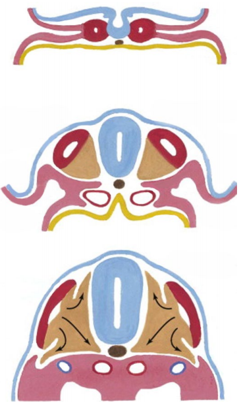
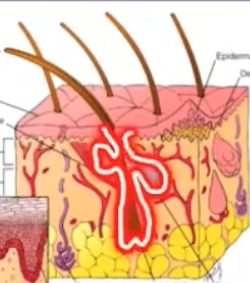
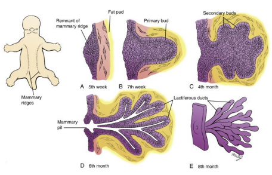
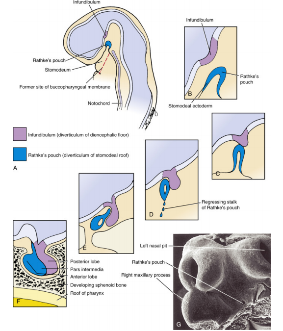

- [Anatomy](#anatomy)
  - [Embryology](#embryology)
    - [Use the correct (quadrupedal) directional terms for describing structures relative to others in the embryo](#use-the-correct-quadrupedal-directional-terms-for-describing-structures-relative-to-others-in-the-embryo)
    - [Describe the developmental processes that take place in weeks 1-3, as demonstrated in this lecture](#describe-the-developmental-processes-that-take-place-in-weeks-1-3-as-demonstrated-in-this-lecture)
    - [Be able to identify and describe the anatomy of the early embryo & its primordia](#be-able-to-identify-and-describe-the-anatomy-of-the-early-embryo--its-primordia)
    - [Describe the 5 embryonic mechanisms used](#describe-the-5-embryonic-mechanisms-used)
    - [Identify embryological structures & cavities, knowing what they are derived from](#identify-embryological-structures--cavities-knowing-what-they-are-derived-from)
    - [Understand the development & the role played by the notochord](#understand-the-development--the-role-played-by-the-notochord)
    - [Understand & Describe how embryonic folding contributes to the formation of body cavities](#understand--describe-how-embryonic-folding-contributes-to-the-formation-of-body-cavities)
    - [Understand the partitioning of the coelomic cavity into its derivatives](#understand-the-partitioning-of-the-coelomic-cavity-into-its-derivatives)
    - [Understand the development of septum transversum and the diaphragm](#understand-the-development-of-septum-transversum-and-the-diaphragm)
    - [Explain the different structures and organs that are derived from each of the embryonic germ layers](#explain-the-different-structures-and-organs-that-are-derived-from-each-of-the-embryonic-germ-layers)
      - [Endoderm](#endoderm)
      - [Ectoderm](#ectoderm)
      - [Mesoderm](#mesoderm)
    - [Understand the derivatives of each different segment of ectoderm and how they developed in relation to neurulation and folding](#understand-the-derivatives-of-each-different-segment-of-ectoderm-and-how-they-developed-in-relation-to-neurulation-and-folding)
      - [**Surface Ectoderm: Epidermis**<a name="epidermis"></a>](#surface-ectoderm-epidermis)
      - [**Surface Ectoderm: Rathke's Pouch**<a name="rathkes-pouch"></a>](#surface-ectoderm-rathkes-pouch)
      - [**Surface Ectoderm: 'Seek and Destroy' Organs**<a name="seek-destroy-organs"></a>](#surface-ectoderm-seek-and-destroy-organs)
      - [**Neural Tube: Central Nervous System**<a name="cns"></a>](#neural-tube-central-nervous-system)
      - [**Neural Crest: Peripheral Nervous System**<a name="pns"></a>](#neural-crest-peripheral-nervous-system)
      - [**Neural Crest: Dorsal Root Ganglion**<a name="drg"></a>](#neural-crest-dorsal-root-ganglion)
      - [**Neural Crest: Autonomic Ganglion**<a name="ag"></a>](#neural-crest-autonomic-ganglion)
      - [**Neural Crest: Adrenal Medulla**<a name="am"></a>](#neural-crest-adrenal-medulla)
    - [Describe the specific contributions of the different types of mesoderm (somites, intermediate, lateral plate)](#describe-the-specific-contributions-of-the-different-types-of-mesoderm-somites-intermediate-lateral-plate)
      - [Paraxial Mesoderm](#paraxial-mesoderm)
      - [Intermediate Mesoderm](#intermediate-mesoderm)
      - [Lateral Plate Mesoderm](#lateral-plate-mesoderm)
    - [Define each of the four primary tissue types](#define-each-of-the-four-primary-tissue-types)
    - [Describe the different subtypes of each tissue type and where they can be found in the body](#describe-the-different-subtypes-of-each-tissue-type-and-where-they-can-be-found-in-the-body)
    - [Describe the respective properties of each subtype of tissue](#describe-the-respective-properties-of-each-subtype-of-tissue)
    - [Be able to identify different tissue types from micrograph images and specimens](#be-able-to-identify-different-tissue-types-from-micrograph-images-and-specimens)
    - [Differentiate cell and tissue types, whilst being able to justify your decision based on what is present and/or not present](#differentiate-cell-and-tissue-types-whilst-being-able-to-justify-your-decision-based-on-what-is-present-andor-not-present)
    - [Relate structure to function](#relate-structure-to-function)
    - [Define each type of epithelia and describe the respective functions/purpose of each](#define-each-type-of-epithelia-and-describe-the-respective-functionspurpose-of-each)
    - [Describe the different layers of tube structures and understand how they change with function/body site](#describe-the-different-layers-of-tube-structures-and-understand-how-they-change-with-functionbody-site)
    - [Describe the basic histological appearance of section of the nephron of the kidney](#describe-the-basic-histological-appearance-of-section-of-the-nephron-of-the-kidney)
    - [Describe the structure of blood tubes and how to identify/differentiate them](#describe-the-structure-of-blood-tubes-and-how-to-identifydifferentiate-them)
    - [Describe the different layers and types of skin and how to identify them](#describe-the-different-layers-and-types-of-skin-and-how-to-identify-them)
    - [Describe which embryological germ layer each epithelium is derived from](#describe-which-embryological-germ-layer-each-epithelium-is-derived-from)

# Anatomy
<!-- Embryology -->
## Embryology
### Use the correct (quadrupedal) directional terms for describing structures relative to others in the embryo

|Directional Term| Description|Opposite Term|Description|
|-:|:-:|-:|:-:|
|Ventral|Towards the belly|Dorsal|Towards the back|
|Cranial|Towards the head|Caudal|Towards the tail|
|Anterior|See Cranial|Posterior|See Caudal|
|Proximal|Closer to the body|Distal|Further from the body|
|Transverse Plane|Divides body into Cranial and Caudal sections|||
|Frontal Plane|Divides body into Ventral and Dorsal sections|||
|Sagittal Plane|Divides body into L and R sections|||

### Describe the developmental processes that take place in weeks 1-3, as demonstrated in this lecture

### Be able to identify and describe the anatomy of the early embryo & its primordia

### Describe the 5 embryonic mechanisms used
|Embryonic Mechanism|Description|
|-:|:-|
|Proliferation|Growth in number of cells|
|Migration|Movement of cells from one area to another|
|Differentiation|Alteration of a cells own developmental trajectory|
|Induction|Signalling neighbouring cells to differentiate|
|Combination|Combination of cells from different germ layers to form organs|


### Identify embryological structures & cavities, knowing what they are derived from

### Understand the development & the role played by the notochord

### Understand & Describe how embryonic folding contributes to the formation of body cavities
### Understand the partitioning of the coelomic cavity into its derivatives
### Understand the development of septum transversum and the diaphragm
### Explain the different structures and organs that are derived from each of the embryonic germ layers

>TODO
>- [ ] Add pneumonics etc to assist with memory recollection

----

#### Endoderm
| Structure | Description     |
| :-------: | :-------------- |
| Gut Tube  | Epithelium only |
|Appendages of the Gut Tube<br/>           ||
|Respiratory|The conductive airways through from the larynx through into the lungs|
|Liver & Gall Bladder|
|Pancreas|
|Urinary Bladder| Occurs after GIT differentiates from the urogenital system|


----

#### Ectoderm
|Derivative|Structure|
|:-:|:-|
|Surface Ectoderm (SE)|[Epidermis](#epidermis)|
| |[Rathke's Puch](#rathkes-pouch)|
| |['Seek and Destroy' organs](#seek-destroy-organs)|
|- ||
|Neural Tube Ectoderm (NT)|[Central Nervous System](#cns)|
| NT Walls|Brain|
| |Spinal Cord|
| NT Canal|Ventricles|
| |Central Canal|
| -||
|Neural Crest Cells (NCC)|[Peripheral Nervous System (PNS)](#pns)|
| |Dorsal Root Ganglion (DRG)|
| |Autonomic Ganglion|
| |Adrenal Medulla|
| |`Schwann Cells`|
| |`Leptomeninges`|
| |`Melanocytes`|
| |`Dentine`|
| |`Cornea`|

----

#### Mesoderm

|Derivative|Structure|
|:-:|:-|
|Paraxial Mesoderm|Somites|
|-||
|Intermediate Mesoderm|Paired Glands|
|-||
|Lateral Plate|Somatopleure|
| |Splanchnopleure|
| |Cranial Mesoderm|
| |Adrenal Cortex|
|Somatopleure|Body Wall|
|Splanchnopleure|Visceropleure (Gut Connective tissues, cardiogenic mesoderm, spleen etc)



### Understand the derivatives of each different segment of ectoderm and how they developed in relation to neurulation and folding
#### **Surface Ectoderm: Epidermis**<a name="epidermis"></a>

`The skin!`
- Derived from the **Somatopleure**. `Somato = Body | Pleure = Wall`
  - Component of surface ectoderm with a component of lateral plate mesoderm
- Most exposed component
  - Protective
  - Interactive
    - Hair, sweating etc
- **Epidermal Appendages** <br/> ```Develop from the Ectoderm, but has embed itself in the Mesoderm (Dermis)```
  - Hair follicles and sebaceous glands
  - Finger Nails
  - Mammary glands
    - Proliferate -> Form buds -> Canalisation (duct system forming within)
    - The secreting tissue of the Mammary tissue is derived from Ectoderm
      - The surrounding tissue is derived from the Mesoderm
- **Water proofing**
  - Keratinised cells provide a layer of dead cell protection
    - Water proofing (hydrophobic)
    - Barrier for infection


>TODO
>- [ ] Format and caption the images
>
>




#### **Surface Ectoderm: Rathke's Pouch**<a name="rathkes-pouch"></a>
```
The Oralpharyngeal membrane forms into a Stomodeum (`Stomo = Opening`)
This is actually just an invagination of the Surface Ectoderm.
    
    Only at the back of the mouth do we have a change between Ectodermal lining
and Endodermal lining which would be where the Oralpharyngeal membrane would have
been located.

    This is relevant due to the dual origin of the Pituitary gland from the Neural
Tube and Rathke's Pouch (from Surface Ectoderm)
```
- Anterior Pituitary
  - `Derivative from Rathke's pouch (Surface Ectoderm)`
- Posterior Pituitary
  - `Neural Component derived from the forebrain`

>   
> Development of the Pituitary gland with a Neural derivative and Surface Ectoderm derivative

#### **Surface Ectoderm: 'Seek and Destroy' Organs**<a name="seek-destroy-organs"></a>
```
Seek and Destroy organs references the eye and teeth primarily
```
- **Lens of the eye**
  - Due to the lining of the face, the lens of the eye devolops from an invagination and engulfment of the Surface Ectoderm. [See below](#eye-lens-image1)
- **Enamel of the teeth**
  - Due to the lining of the mouth, the enamel of the teeth develops from the SE. [See below](#enamel-image1)

> <a name="eye-lens-image1"></a>  
> Seen here is the invagination and engulfment of the Surface Ectoderm which will differentiate into the Optical Lens

> <a name="enamel-image1"></a>  
> The Enamel of the tooth is a derivative of the Surface Ectoderm as shown, however the Dentine derives from the Mesenchyme which is either Mesodermic or Neural Crest in origin
#### **Neural Tube: Central Nervous System**<a name="cns"></a>
```
Forms the Central Nervous System
```
- Walls of the tube form the **Brain & Spinal Cord**
- Canal of the tube form the **Ventricles and Central Canal**
  - These are functional spaces within the brain
  - Allow fluid to flow from Brain right down Spinal Cord

#### **Neural Crest: Peripheral Nervous System**<a name="pns"></a>

#### **Neural Crest: Dorsal Root Ganglion**<a name="drg"></a>
```
Sympathetic Nerves
```
#### **Neural Crest: Autonomic Ganglion**<a name="ag"></a>

#### **Neural Crest: Adrenal Medulla**<a name="am"></a>
```
The Medulla of the Adrenal gland is formed from derivatives of Neural Crest
cells while the Cortex of the Adrenal gland is formed from the Mesothelium
```

### Describe the specific contributions of the different types of mesoderm (somites, intermediate, lateral plate)

>
>1. Notochord `Axial Mesoderm`
>2. Paraxial Mesoderm
>3. Neural Tube formation

|                    Mesoderm                     | Derivative Structure        |
| :-----------------------------------------------: | :--------------- |
|      [Paraxial Mesoderm](#paraxial-mesoderm)      | Sclerotome       |
|                                                   | Dermatome        |
|                                                   | Myotome          |
|  [Intermediate Mesoderm](#intermediate-mesoderm)  | Paired Glands    |
| [Lateral Plate Mesoderm](#lateral-plate-mesoderm) | Somatopleure     |
|                                                   | Splanchnopleure  |
|                                                   | Cranial Mesoderm |
|                                                   | Adrenal Cortex   |


----

#### Paraxial Mesoderm
`Form Somites`

Somites have 3 components:
1. Sclerotome
`Sclero - Bone/Skeleton`
   - Develops into Axial Skeleton
     - Vertebrae including ribs (see [image](#sclerotome-image1))
     - Not responsible for [bones in limbs](#lateral-plate-mesoderm)
2. Dermatome
3. Myotome
> Somites are segmented (see [image](#somites-image1))  
> This is why we have numbered vertebrae  
> Similarly, Myotomes are also segmented  

The Dermatome and Myotome fuse existing as **Dermamyotomes**
- Myotome component
  - Forms the muscles of the body wall & limbs


> <a name="sclerotome-image1"></a>  
> Seen above is migration of Sclerotome to surround the Neural Tube as is expected in formation of our vertebrae


> <a name="somites-image1"></a>  
> Seen here is an embryo with clear division of the somites along the dorsal surface

----

#### Intermediate Mesoderm
```
Forms paired glands:
    - Kidneys
    - Gonads
    - Accessory Urinary/Reproductive Glands
```

----

#### Lateral Plate Mesoderm
```
Involved with Connective Tissue of the viscera (organs) and body wall.
Has a few special function derivatives too
```
- Somatopleure
  - Body wall
  - Limbs develop as as an extension of the Body Wall
    - Connective tissues, dermis, tendons, bones etc
    - However [not the skeletal muscle](#paraxial-mesoderm)
- Splanchnopleure
- Cranial Mesoderm
  - Complex -> Involved with replacing some derivatives of the Neural Crest Cells in the cranium
- Adrenal Cortex
  - Cortex is formed from mesothelium while the Medulla is formed from Neural Crest Cells

----

### Define each of the four primary tissue types
|Primary Tissue Type|Definition|
|-:|:-|
|Epithelium|
|Connective|
|Muscle|
|Nervous|

### Describe the different subtypes of each tissue type and where they can be found in the body

|Type|Description|Where?|Image|
|:-:|:-|:-:|:-:|
|**Epithelial Tissues**||||
|Simple Squamous|
|Simple Cuboidal|
|Simple Columnar|
|Stratified Squamous|
|Stratified Cuboidal|
|PseudostratifiedColumnar|
|Transitional|
|**Connective Tissues**||||
|Dense Connective Tissue|
|Loose Connective Tissue|
|Reticular Connective Tissue|
|Cartilage|
|Bone|
|Blood|
|Adipose Tissue|
|Embryonic Connective Tissue|
|**Muscular Tissues**||||
|Skeletal Muscle|
|Smooth Muscle|
|Cardiovascular Muscle|
|**Nervous Tissues**||||
|Neurons|
|Neuroglia|


### Describe the respective properties of each subtype of tissue
|Type|Properties|
|:-:|:-|
|**Epithelial Tissues**||
|Simple Squamous|
|Simple Cuboidal|
|Simple Columnar|
|Stratified Squamous|
|Stratified Cuboidal|
|PseudostratifiedColumnar|
|Transitional|
|**Connective Tissues**||
|Dense Connective Tissue|
|Loose Connective Tissue|
|Reticular Connective Tissue|
|Cartilage|
|Bone|
|Blood|
|Adipose Tissue|
|Embryonic Connective Tissue|
|**Muscular Tissues**||
|Skeletal Muscle|
|Smooth Muscle|
|Cardiovascular Muscle|
|**Nervous Tissues**||
|Neurons|
|Neuroglia|

### Be able to identify different tissue types from micrograph images and specimens
### Differentiate cell and tissue types, whilst being able to justify your decision based on what is present and/or not present
### Relate structure to function
### Define each type of epithelia and describe the respective functions/purpose of each
### Describe the different layers of tube structures and understand how they change with function/body site
### Describe the basic histological appearance of section of the nephron of the kidney
### Describe the structure of blood tubes and how to identify/differentiate them
### Describe the different layers and types of skin and how to identify them
### Describe which embryological germ layer each epithelium is derived from


