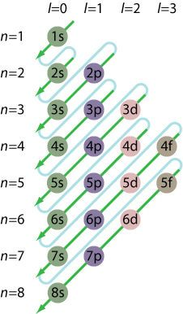
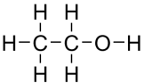
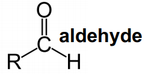
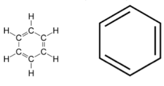
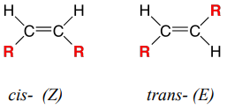
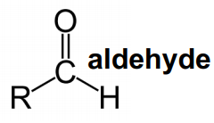
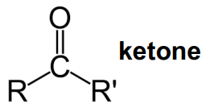

- [Biochemistry](#biochemistry)
    - [Name the cellular macromolecules, and have an understanding of their structure and function](#name-the-cellular-macromolecules-and-have-an-understanding-of-their-structure-and-function)
    - [Know the biologically important elements and which macromolecules they are in](#know-the-biologically-important-elements-and-which-macromolecules-they-are-in)
    - [Define an atom (including electron arrangement in shells), electron, neutron and proton](#define-an-atom-including-electron-arrangement-in-shells-electron-neutron-and-proton)
    - [Describe covalent and noncovalent bonds and give examples](#describe-covalent-and-noncovalent-bonds-and-give-examples)
    - [Have an understanding of the chemistry of carbon and its importance in organics](#have-an-understanding-of-the-chemistry-of-carbon-and-its-importance-in-organics)
    - [Have a general understanding of the different types of bonds and relative bond energies](#have-a-general-understanding-of-the-different-types-of-bonds-and-relative-bond-energies)
    - [Define polarity, chemistry and properties of water and its role in ionisation and hydration](#define-polarity-chemistry-and-properties-of-water-and-its-role-in-ionisation-and-hydration)
    - [Define concentration, mole and molarity](#define-concentration-mole-and-molarity)
    - [Describe the differences between acids and bases, and between strong/weak acids and bases](#describe-the-differences-between-acids-and-bases-and-between-strongweak-acids-and-bases)
    - [Define pH and know what physiological pH is](#define-ph-and-know-what-physiological-ph-is)
    - [Understand the role of buffers](#understand-the-role-of-buffers)
    - [Name and distinguish between organics such as alkanes, alkenes, alcohols, thiols, aldehydes, carboxylic acids, amines and aromatics](#name-and-distinguish-between-organics-such-as-alkanes-alkenes-alcohols-thiols-aldehydes-carboxylic-acids-amines-and-aromatics)
    - [Understand how conjugation in aromatic rings impacts structure and function](#understand-how-conjugation-in-aromatic-rings-impacts-structure-and-function)
    - [Recognise the functional groups given](#recognise-the-functional-groups-given)
    - [Have an understanding of the importance of isomers, particularly optical isomers](#have-an-understanding-of-the-importance-of-isomers-particularly-optical-isomers)
    - [Recognise carbohydrates and derivatives](#recognise-carbohydrates-and-derivatives)
    - [Recognise the structure and roles of glycerol, fatty acids, triacylglycerols, phospholipids and steroids](#recognise-the-structure-and-roles-of-glycerol-fatty-acids-triacylglycerols-phospholipids-and-steroids)
    - [Recognise that AA have chemical classifications, and know the basic and acidic AA names](#recognise-that-aa-have-chemical-classifications-and-know-the-basic-and-acidic-aa-names)
    - [Understand that AA are zwitterions and be able to draw their structure and different pHs](#understand-that-aa-are-zwitterions-and-be-able-to-draw-their-structure-and-different-phs)
    - [Understand and be able to draw and label components of peptides, and know levels of protein structure hierarchy, including bonds and structures therein](#understand-and-be-able-to-draw-and-label-components-of-peptides-and-know-levels-of-protein-structure-hierarchy-including-bonds-and-structures-therein)
    - [Define prosthetic groups, simple, conjugated, fibrous globular, native and denatured proteins](#define-prosthetic-groups-simple-conjugated-fibrous-globular-native-and-denatured-proteins)
    - [Know the general functions of proteins](#know-the-general-functions-of-proteins)
    - [Understand that proteins bind ligands](#understand-that-proteins-bind-ligands)
    - [Have a basic understanding of metabolism & energetics of reactions](#have-a-basic-understanding-of-metabolism--energetics-of-reactions)
    - [Know the meaning of: free energy, substrate, product, active site, transition state, activation energy, endergonic reaction, exergonic reaction, energy transfer](#know-the-meaning-of-free-energy-substrate-product-active-site-transition-state-activation-energy-endergonic-reaction-exergonic-reaction-energy-transfer)
    - [Have a basic understanding of cellular energy and ATP's role in the cell](#have-a-basic-understanding-of-cellular-energy-and-atps-role-in-the-cell)
    - [Have an understanding of enzymes as catalysts and of the mechanism of enzyme action in cells](#have-an-understanding-of-enzymes-as-catalysts-and-of-the-mechanism-of-enzyme-action-in-cells)
    - [Understand the impact on enzyme activity of temperature, pH, substrate concentration](#understand-the-impact-on-enzyme-activity-of-temperature-ph-substrate-concentration)
    - [Understand the need for controlling enzyme activity, including: allosterism, inhibitors, inhibition and feedback](#understand-the-need-for-controlling-enzyme-activity-including-allosterism-inhibitors-inhibition-and-feedback)
    - [Appreciate the role of enzymes, pathways, "high energy" carriers, cofactors & coenzymes in metabolism](#appreciate-the-role-of-enzymes-pathways-high-energy-carriers-cofactors--coenzymes-in-metabolism)
    - [Know the general classes of enzymes and their functions](#know-the-general-classes-of-enzymes-and-their-functions)
    - [Understand redox reactions and the role of redox reactions in metabolism](#understand-redox-reactions-and-the-role-of-redox-reactions-in-metabolism)
    - [Know that NADH & FADH2 are important electron carriers](#know-that-nadh--fadh2-are-important-electron-carriers)
    - [Understand the significance of Redox Potential values](#understand-the-significance-of-redox-potential-values)
    - [Understand reduced bonds and realise that many of our metabolic pathways are oxidative](#understand-reduced-bonds-and-realise-that-many-of-our-metabolic-pathways-are-oxidative)
    - [Have a general understanding of metabolism, the need for integration of metabolism and the sharing of metabolic roles within the body](#have-a-general-understanding-of-metabolism-the-need-for-integration-of-metabolism-and-the-sharing-of-metabolic-roles-within-the-body)

# Biochemistry

### Name the cellular macromolecules, and have an understanding of their structure and function

:warning: The remaining parts of this learning outcomes are likely to be covered and filled in a later lecture

|Macromolecule|Structure|Function|
|-:|:-|:-|
|Phospholipids|
|DeoxyriboNucleic Acid (DNA)|
|RiboNucleic Acid (RNA)|
|Proteins|
|Polysaccharides (Sugars)|
### Know the biologically important elements and which macromolecules they are in

### Define an atom (including electron arrangement in shells), electron, neutron and proton

- Atom
  - Building block of all matter
  - Composed of Protons, Neutrons and Electrons
  - Properties are decided by the number of each subatomic particle
- Nucleus
  - Protons & Neutrons
- Proton
  - (+) Charge
  - Relative Weight of 1
- Neutron
  - No Charge
  - Relative Weight of 1
- Electron
  - (-) Charge
  - Relative Weight of 0 (0.005)
- Electron Orbital
  - Each Orbital 'holds' 2 electrons
  - Orbitals further to Nucleus contain more energy
  - Electrons can gain/lose energy to move between Orbitals
- Electron Shells
  - Electron -> Orbital -> Sub Shell -> Shell
  - Sub shells hold a specific number of Orbitals/Electrons
    - s
      - 2 electrons
    - p
      - 6 electrons
    - d
      - 10 electrons
    - f
      - 14 electrons
  - Shell Electron arrangements: 
| Shell Number | Electrons | Sub-Shells |
|-:|:-:|:-:|
|1|2|*1s*|
|2|8|*2s, 2p*|
|3|18|*3s, 3p, 3d*|

- Valence Shell
  - Outermost electron shell
  - Valence Electrons = Electrons in this outer shell
- Atomic Number
  - Number of Protons
- Atomic Mass
  - Number of Protons & Neutrons
- Isotope
  - Elements with different number of Neutrons
- Chemical Reactivity
  - Noble Gas Rule
    - `An atom bonds to fill its outer shell of electrons and to achieve the number of electrons of the noble gas nearest to it`
  - Elements will undergo reactions/form bonds to achieve this

---

>   
> This shows the order with which sub-shells fill their electron due to the nature of electrons filling Sub-Shells of lower energy over filling Shells of lower energy first.  
> This demonstrates why although Shell 3 should have 18 electrons, it usually has 8.
> 
### Describe covalent and noncovalent bonds and give examples
Sharing/Exchanging e- to fill valence shell forms chemical bonds.  
Atoms join to form molecules.

**Covalent Bonds**
> A covalent bond is a chemical bond that involves sharing electron pairs between atoms
> 
> Examples of Covalent bonding:
> - Oxygen
>     - Double Covalent Bond between two oxygen atoms
>     - O=O
> - Water (H2O)
>     - Two Hydrogens Covalent Bonded to Oxygen with Single Covalent Bonds
>     - H-O-H


**Non-Covalent Bonds**
> Do not involve the sharing of electrons.  
> Involves weaker electromagnetic interactions between molecules or within a molecule  
> 
> There are Ionic Bonds, Hydrogen Bonds, Van der Waals forces, Hydrophobic interactions, Dipole-Dipole forces  
> 
> Examples: NaCl; binding forces that keep Water a liquid at room temperature (Hydrogen Bonds)

:label: Covalent bonds form molecules while Non-Covalent bonds bring them together. Examples of this are cellular structures such as Ribosomes.

### Have an understanding of the chemistry of carbon and its importance in organics
> Carbon is the building block of all Organic molecules

|Property|Value (if relevant)|
|:-:|:-:|
|Atomic Number|6|
|Atomic Mass|12|
|Potential to form 4 bonds||
|Single bonds are shorter than double bonds||
|Single bonds can rotate||
|Aliphatic|Carbon chain compounds|
|Aromatic|Ring structures|


### Have a general understanding of the different types of bonds and relative bond energies

|Bond|Energy<br/>Remember Relative Str|
|-:|:-:|
|Double Covalent Bond|>600|
|Single Covalent Bond|>210|
|**Non Covalent Bonds:**|
|Ionic Bonds|4-80|
|Hydrogen Bonds|12-30|
|Van der Waals|0.3-9|
|Hydrophobic Interactions|weak|


**Covalent Bonds**
> Atoms involved in Covalent Bonds however are not the same. Oxygen would have a much stronger pull on the electrons than Hydrogen would. This ability is measured by Electronegativity.  
> Examples of high Electronegative elements are Fluoride, Oxygen and Nitrogen  
> 
> This is an important concept in organics. In a covalent bond, the shared electrons will be closer towards the more Electronegative atom. This will create a minor polarity or 'charge' across the molecule.  
>   
> :label: Singular Covalent bonds inherently allow some flexibility in the molecule, this is lost in Double Covalent Bonds as seen in Ethane vs Ethene


**Non-Covalent Bonds**
> Below you can see the formation of Ionic Bonds:   
>   
> An example of this is NaCl
> 
> Hydrogen Bonds involves the interaction molecules that contain High Electronegative elements such as Oxygen bound to Hydrogen. The Polarity created in this covalent bond is significant. The Positive polar Hydrogen atoms would interact with the Negative polar bound atoms in other molecules.  
>   
> An example of a material that is heavily dependent on this interaction is Water.  
> It explains why, despite the low molecular weight, that water can exist as a liquid at room temperature.

**Ionic Bonds**

> :label: Not all Ionic bonds involve *complete* e- transfer

|Name|Charge|
|:-:|:-:|
|Cation|+|
|Anion|-|

Due to their charge, Cations and Anions bond together to form Ionic Bonds
> :label: This bond forms due to electromagnetic attraction. Can be broken/dispersed by other electromagnetic interactions. This is seen with **hydration**

**Hydrogen Bonds**

> :label: O-H is a strong dipolar bond. This means O has - polarity while H has + polarity

  

### Define polarity, chemistry and properties of water and its role in ionisation and hydration

---

```
Electronegativity is arbitrarily measured; it increases as you go from
left to right, and from bottom to the top of the periodic table.
```

---

:pushpin: Covalent bonds between different electronegative elements have an uneven distribution of charge and therefore have polarity/charge

:pushpin: Electronegative elements: Oxygen, Nitrogen, Fluoride

:grey_question: Below is the electronegative values of biologically important elements. Bonds are considered non-polar if the difference between them is not >0.5

|Element|Electronegativity|
|-:|:-:|
|H|2.1|
|C|2.5|
|**N**|**3**|
|**O**|**3.5**|
|**F**|**4**|

Therefore, molecules lacking electronegative atoms are non polar (eg: Ethane)
> Reactivity of molecules is associated with # polarised bonds

---

**Water**
|Water Properties|
|:-:|
|:small_red_triangle: Boiling Point|
|:small_red_triangle: Melting Point|
|:small_red_triangle: Heat of Vaporisation|
|Strong Cohesion|
|Strong Surface Tension|
|Hydrogen bonds ~ 2x longer than O-H|
|Floats as solid|
|Hydrogen Bonds form lattice in solid|
|Excellent solvent for polar solutes|

- H2O is polar
  - Able to interact with other polar & charged groups
  - Forms Hydrogen bonds
- Hydrophilic
  - Groups that interact with water
- Hydrophobic
  - Nonpolar groups

---

**Ionisation**

When a highly electronegative atom captures electrons from other atoms during chemical reactions

---

**Hydration**

When Polar Water molecules surround ions and 'shield' them from one another.


> :label: Ionic compounds can therefore separate into constituent anions and cations in water
> 
> :label: Nonionic compounds can also dissolve through forming hydrogen bonds. Eg: alcohol, sugars etc
> > Water forms hydration shell and maintains Hydrogen bonds between other water molecules

### Define concentration, mole and molarity

> Avagadro's number = 6.022 x 10^23

|Term|Definition|
|-:|:-|
|Concentration|Molarity or grams per litre|
|Mole|Avagadro's number of molecules|
|Molarity (M)|1 mole in 1 litre|


### Describe the differences between acids and bases, and between strong/weak acids and bases

|Term|Definition|
|-:|:-|
|Acid|Proton donor|
|Base|Proton acceptor|
|Strong|Completely ionises in solution|
|Weak|Partially ionises in solution|
|`Strong Bases produce proton-accepting species (eg: OH-)`||

### Define pH and know what physiological pH is

**pH**
> Measure of acidity in terms of molar concentration
```
Scale: 0-14
^ pH = more Basic
v pH = more acidic
pH 7 = neutral
```

**Physiological pH** = 7.4

### Understand the role of buffers

> :grey_exclamation: Remember reversible reactions:
> ```
> Lets say there is a reversible reaction such as the Ionisation of a weak acid:
>   HA  +  H2O <-> H3O+  +  A-
> These reactions have an equilibrium point. Adding more of a chemical of either
> side of the reaction will drive the reaction to remove the added chemical and
> reachieve equilibrium.
> ```

Physiological processes require tight control of pH. This is achieved through buffering.

**Buffers** resist changes in pH usually brought about by addition of acid/base. They are weak acids and/or bases.

### Name and distinguish between organics such as alkanes, alkenes, alcohols, thiols, aldehydes, carboxylic acids, amines and aromatics
|Organic|Description|Example|
|:-|:-|:-:|
|Alkanes|Contain C & H with single bonds|Methane |
|Alkenes|Contain C=C double bonds|Ethene |
|Alcohol|Addition of hydroxyl group (-OH)|Ethanol |
|Thiols|Addition of sulfhydryl group (-SH)||
|Aldehyde|Contain C=O||
|Carboxylic Acid|End Carbon has Oxygen double bond and a hydroxyl bond||
|Amine|Derived from ammonia (NH3)|<br/>|
|Aromatics|Ring structures of carbon (or another Element) chains|**Benzene** |
|`Benzene demonstrates electron resonance. The double bonds and single bonds can swap repeatedly; there is conjugation of the p orbitals within the structure. This electron movement increases the stability of Benzene. This principle can be represented by a circle within the Aromatic`<a name="electron-resonance"><a/>|||


> :label: The following table is not required under this learning outcome, however may be helpful.
> 
> |Root|Number of C Atoms|
> |-:|:-:|
> |Meth**yl**|1|
> |Eth**yl**|2|
> |Prop**yl**|3|
> |But**yl**|4|
> |Pent**yl**|5|
> |Hex**yl**|6|
> |Hept**yl**|7|
> |Oct**yl**|8|
> |Non**yl**|9|
> |Dec**yl**|10|

> :label: The following explains cis/trans isomers however is not required under this learning outcome
> ```
> Alkenes do not allow rotational/geometric flexibility = Geometric Isomers which can have
> physically different properties.
> Geometric isomers labeled cis or trans.
> ```
> 

### Understand how conjugation in aromatic rings impacts structure and function
[See above](#electron-resonance)

### Recognise the functional groups given

|Functional Group|Image|
|-:|:-:|
|Hydroxyl||
|Amino||
|Carboxyl||
|Aldehyde||
|Ketone||
|Methyl||
|Sulfhydryl||
|Disulfide||
|Acetyl||
|Phosphate||
### Have an understanding of the importance of isomers, particularly optical isomers


:grey_exclamation::grey_question: Only Enantiomers and Constitutional Isomers discussed in lecture; there wasn't any direct reference made to Diastereomers


> Molecule is Chiral if it cannot be superposed on its mirror image by any combination of rotations and translations  
> ```
> Derived from Ancient Greek meaning of "hand"
> ```

|Isomerism|Definition|
|-:|:-|
|Structural Isomer|Different in specific attachment of atoms and functional groups|
| |`There are subdivisions under this: Chain isomers; Position isomers; Functional group isomers; Skeletal isomers; Tautomer`
|Stereoisomer|Identical Bond structure but different with geometric position of functional groups & atoms|
|Enantiomers|Mirror images which contain chiral centres & are not superimposable|
|`Diastereomers`|`Are not mirror-images; may or may not contain chiral centers`|
|`Conformational Isomers`|`Different rotations around single bonds`|

:question: Enantiomer and Optical Isomer are interchangeable terms. You could argue it might be more correct to call a set of Optical Isomers Enantiomers. You do you.

:label: Enantiomers are labeled by their deflection of light
|Enantiomer|Light Deflection|
|:-:|:-|
|D|Right|
|L|Left|
|-||
|R|Right|
|S|Left|
|-||
|+|Right|
|-|Left|
> The above is separated into their nomenclature groups. Don't use S with D or + etc. Stick with one. Both groups are easy to remember because L = Left and R = Right. You just have to remember the paired nomenclature.

In relation to Enantiomers, a **racemic** mix has equal amounts of both D and L enantiomers = no optical activity

Enantiomers are detrimental in the development of pharmaceuticals. Often only 1 isomer has desired effect (target cell receptors have isomerism too; you can't expect both isomers to fit the same target).

> 
> :grey_question: Thalidomide was a racemic mix. One isomer was responsible for the relief of morning sickness while the other isomer was the cause of its teratogenicity.

### Recognise carbohydrates and derivatives
### Recognise the structure and roles of glycerol, fatty acids, triacylglycerols, phospholipids and steroids
### Recognise that AA have chemical classifications, and know the basic and acidic AA names
### Understand that AA are zwitterions and be able to draw their structure and different pHs
### Understand and be able to draw and label components of peptides, and know levels of protein structure hierarchy, including bonds and structures therein
### Define prosthetic groups, simple, conjugated, fibrous globular, native and denatured proteins
### Know the general functions of proteins
### Understand that proteins bind ligands
### Have a basic understanding of metabolism & energetics of reactions
### Know the meaning of: free energy, substrate, product, active site, transition state, activation energy, endergonic reaction, exergonic reaction, energy transfer
### Have a basic understanding of cellular energy and ATP's role in the cell
### Have an understanding of enzymes as catalysts and of the mechanism of enzyme action in cells
### Understand the impact on enzyme activity of temperature, pH, substrate concentration
### Understand the need for controlling enzyme activity, including: allosterism, inhibitors, inhibition and feedback
### Appreciate the role of enzymes, pathways, "high energy" carriers, cofactors & coenzymes in metabolism
### Know the general classes of enzymes and their functions
### Understand redox reactions and the role of redox reactions in metabolism
### Know that NADH & FADH2 are important electron carriers
### Understand the significance of Redox Potential values
### Understand reduced bonds and realise that many of our metabolic pathways are oxidative
### Have a general understanding of metabolism, the need for integration of metabolism and the sharing of metabolic roles within the body


