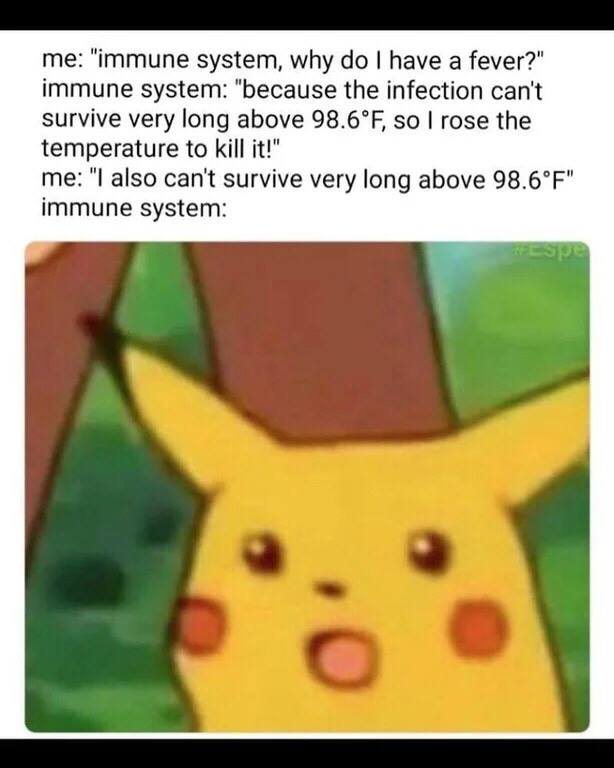
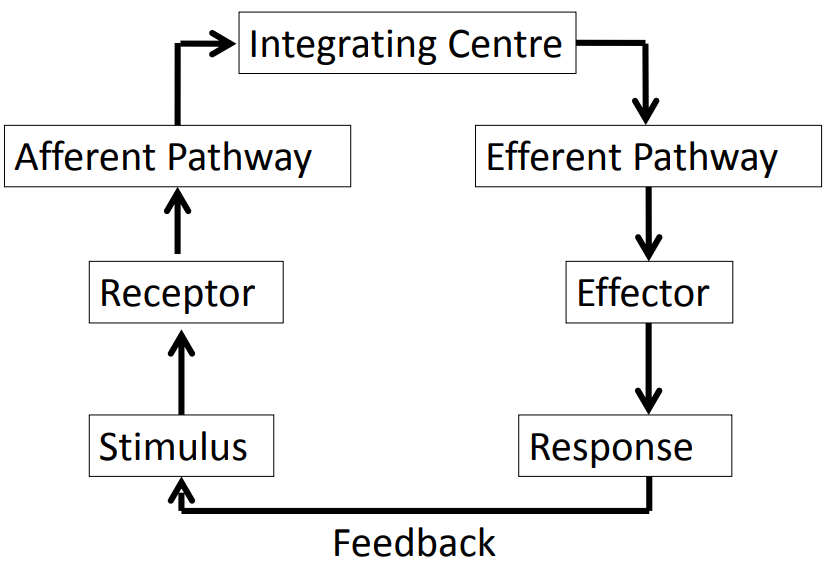
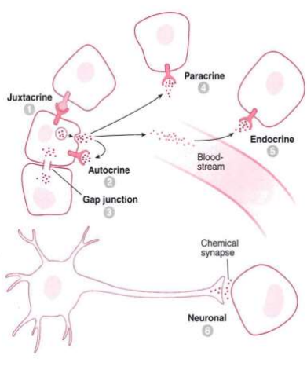
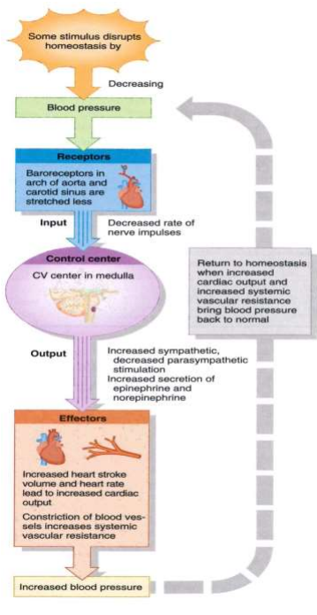
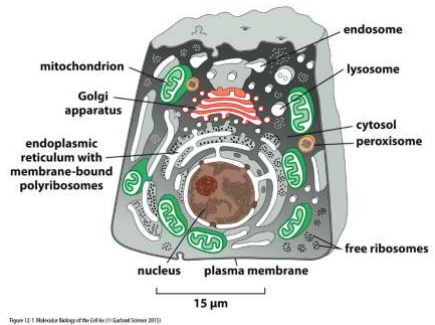

- [Physiology](#physiology)
- [Cellular Physiology](#cellular-physiology)
  - [Gain an understanding of the field of Physiology](#gain-an-understanding-of-the-field-of-physiology)
  - [Describe the level of organisation in the body](#describe-the-level-of-organisation-in-the-body)
  - [Know the constituents of the intracellular and extracellular environment](#know-the-constituents-of-the-intracellular-and-extracellular-environment)
  - [Discuss the concept of homeostasis and homeostatic control systems](#discuss-the-concept-of-homeostasis-and-homeostatic-control-systems)
    - [Homeostasis](#homeostasis)
    - [Homeostatic Control Systems](#homeostatic-control-systems)
    - [Control Concepts](#control-concepts)
    - [Feed-Forward Control](#feed-forward-control)
  - [Know that multicellular life involves specialisation of individual cells and communication between cells](#know-that-multicellular-life-involves-specialisation-of-individual-cells-and-communication-between-cells)
  - [Describe and understand the forms of communication between cells](#describe-and-understand-the-forms-of-communication-between-cells)
    - [Juxtacrine](#juxtacrine)
    - [Gap Junctions](#gap-junctions)
    - [Autocrine](#autocrine)
    - [Paracrine](#paracrine)
    - [Endocrine](#endocrine)
    - [Neural](#neural)
    - [Neuroendocrine](#neuroendocrine)
  - [Describe the cellular level of organisation](#describe-the-cellular-level-of-organisation)
    - [Organelles](#organelles)
  - [List the main organelles and other major structures of a cell, describe their structure and explain their functions](#list-the-main-organelles-and-other-major-structures-of-a-cell-describe-their-structure-and-explain-their-functions)
    - [Nucleus](#nucleus)
    - [Mitochondria](#mitochondria)
    - [Lysosomes](#lysosomes)
    - [Peroxisomes](#peroxisomes)
    - [Endoplasmic Reticulum](#endoplasmic-reticulum)
    - [Golgi Apparatus](#golgi-apparatus)
    - [Vesicles](#vesicles)
  - [Develop an understanding of membrane structure and function](#develop-an-understanding-of-membrane-structure-and-function)
    - [Membrane](#membrane)
  - [Understand membrane permeability, diffusion, osmosis, osmolarity and tonicity](#understand-membrane-permeability-diffusion-osmosis-osmolarity-and-tonicity)
  - [Know the osmolarity of ICF and ECF](#know-the-osmolarity-of-icf-and-ecf)
  - [Understand passive diffusion, carrier mediated transport, primary and secondary active transport](#understand-passive-diffusion-carrier-mediated-transport-primary-and-secondary-active-transport)
  - [Understand how coupled transport enables the movement of solutes against an electrochemical gradient](#understand-how-coupled-transport-enables-the-movement-of-solutes-against-an-electrochemical-gradient)
  - [Understand exo and endo-cytosis](#understand-exo-and-endo-cytosis)
  - [Know the composition of different body fluid compartments](#know-the-composition-of-different-body-fluid-compartments)
  - [Explain the ionic basis of membrane potentials](#explain-the-ionic-basis-of-membrane-potentials)
  - [Describe & explain the ionic basis of electrical signaling in nerve and muscle cells (action potentials)](#describe--explain-the-ionic-basis-of-electrical-signaling-in-nerve-and-muscle-cells-action-potentials)
  - [Explain the process of sensory transduction](#explain-the-process-of-sensory-transduction)
  - [Describe how action potentials are propagated along membranes](#describe-how-action-potentials-are-propagated-along-membranes)
  - [Describe neurotransmitter & synaptic physiology](#describe-neurotransmitter--synaptic-physiology)
  - [List common neurotransmitters, their receptors and effects](#list-common-neurotransmitters-their-receptors-and-effects)
  - [Describe the processes involved in the regulated release of neurotransmitters](#describe-the-processes-involved-in-the-regulated-release-of-neurotransmitters)
  - [Outline the metablolism (production and destruction) of neurotransmitters](#outline-the-metablolism-production-and-destruction-of-neurotransmitters)
  - [Describe the formation of both IPSPs and EPSPs](#describe-the-formation-of-both-ipsps-and-epsps)

# Physiology
# Cellular Physiology

## Gain an understanding of the field of Physiology

I'm sorry; how is this a learning outcome?

> Hi I'm here for my first semester exam.  
> `Takes a seat`  
> `first page`  
> `Q1: What is physiology?`  
> **Me:**
> 
## Describe the level of organisation in the body

Atom -> Molecule -> Macromolecule -> Organelle -> Cell -> Tissue -> Organ -> Organ System -> Organism

## Know the constituents of the intracellular and extracellular environment

Extracellular fluid provides cells a maintained environment for functions

> Extracellular fluid can be divided into two primary constituents:  
> ```
> Fluid component of the blood (Plasma)
> Interstitial Fluid (IF) that surrounds all cells not in blood
> ```
> 
> Intracellular Fluid makes up for 60% of the fluid in the body
> 


| Extracellular Fluid Constituents |
| :------------------------------: |
|               pO2                |
|               pCO2               |
|              [Na+]               |
|               [K+]               |
|              [Ca2+]              |
|              [Cl-]               |
|            [Glucose]             |
|          `Temperature`           |
|              `pH`                    |
> These are the constituents from a slide which describes the "Normal Values" of these constituents. That's why items like Temperature are present  
> Note that pO2 and pCO2 stand for the partial pressure of Oxygen and Carbon Dioxide respectively -> used to measure conc of them in blood

## Discuss the concept of homeostasis and homeostatic control systems

### Homeostasis

Two Definitions Provided

> **Homeostasis**: Maintenance of static or constant conditions in the internal environment

> :star: **Homeostasis**: Maintain a steady-state dynamic constancy in a system by resisting change.

### Homeostatic Control Systems

Maintain the stability of the internal system through compensating mechanisms
- Control systems operate via negative feedback
- Antagonistic arms work against each other

Control systems require:
1. Some way to measure the regulated variable
2. Some way to alter (effect) the regulated variable
3. Something linking the two

  
> To understand homeostatic control mechanisms:
> 1. Variable? (K+, temp, bp etc)
> 2. Change detection? (receptors)
> 3. Where is decision to act made? (integrating circuit)
> 4. Communication? (afferent/efferent pathways)
> 5. Effectors? (how is variable regulated)
> 6. How does the negative feedback loop operate?

---

### Control Concepts

|Mechanism|Description|
|-:|:-|
|Negative Feedback|Most Common|
| |Oppose the direction of change then switch themselves off|
|Positive Feedback|**non-homeostatic**|
| |Examples: Blood clotting, neuronal excitation, child birth|


:exclamation: Feed**back** mechanisms are inherently response **after** the fact; the system is "catching up"

---

### Feed-Forward Control

> Anticipatory alteration of effectors - independent of feedback

- Parametric feedforward | Adaptive Control
  - System adapts from previous failures
> Eg: Ballistic control, ball throwing
- Predictive homeostasis | Anticipatory control
  - System anticipates and alters effectors before the causative agent has occured
> Eg: Increasing cardiac function in anticipation of exertion

## Know that multicellular life involves specialisation of individual cells and communication between cells

Do you know this? Now you do.

## Describe and understand the forms of communication between cells



There is also Neuroendocrine

---

### Juxtacrine

Transmembrane/membrane-bound ligand binds receptor of neighbouring target cell.  

> Neurons notch signalling

---

### Gap Junctions

Specialised intercellular connection joins the 2 cytoplasms. Allows passage of molecules/ions. Diffusion of these molecules/ions down concentration gradients is the method of communication.

> Cardiac muscle cells propogation of action potentials

---

### Autocrine

Ligand is secreted into ECF to act on transmembrane receptor of secreting cell.

> Interleukin-1 in monocytes

---

### Paracrine

Ligand is secreted into the ECF and acts on target cell receptors at a distance-not in direct physical contact

> Fgf

---

### Endocrine

Ligand is secreted into the blood where it travels and acts on target cells down stream

> Hormones - Insulin

:label: Very common

---

### Neural

Neuron secretes ligand (neurotransmitters) to act on connected cells.

> Muscle, glands

:label: Neural communication is more specific, however is unfit for more "general" messaging

:label: Very common

---

### Neuroendocrine

Combined neural and endocrine signalling.

---

It is suggested that knowing the name of the receptor (Baroreceptor) and having a general understanding of how this control system works is sufficient:  


## Describe the cellular level of organisation

### Organelles

Internal structures of cell; carry out specialized metabolic tasks

Membranous Organelles
- Membranes allow processes to be contained and maintained in separate protected environments
> Nucleus is protected by a dual membrane envelope

Non-membranous Structures
- Eg: Ribosomes, centrioles, flagella



## List the main organelles and other major structures of a cell, describe their structure and explain their functions

|Organelle|Structure|Function|
|:-:|:-|:-|
|[Nucleus](#nucleus)|
|[Mitochondria](#mitochondria)|
|[Lysosomes](#lysosomes)|
|[Peroxisomes](#peroxisomes)|
|[Endoplasmic Reticulum](#endoplasmic-reticulum)|
|[Golgi Apparatus](#golgi-apparatus)|
|[Vesicles](#vesicles)|


### Nucleus

### Mitochondria

### Lysosomes

### Peroxisomes

### Endoplasmic Reticulum

### Golgi Apparatus

### Vesicles

## Develop an understanding of membrane structure and function

> ```
> Forms outer boundary of aliving cell or of an internal cell compartment. The outer
> membrane is the plasma membrane, and the compartments enclosed by internal membranes
> are called organelles.
> ```

### Membrane
:warning: Within the following block is notes from previous studies and not from the lectures

---

**Biological Membranes:**
- Lipid Bilayers
- Barriers to movement of solutes and water
  - Selective permeability
  - Control of cell volume and ion concentrations
    - Biochemical processes require maintenance of precisely regulated intracellular environment
    - Large expenditure of energy to regulate intracellular concentration of ions
- Plasms Membrane
  - Forms cell outer membrane
  - Impermeable to large molecules
    - Proteins
    - Nucleic Acids
    - Ensures their retention in cytosol
  - Selective permeability to small molecules
    - Ions metabolites
  - Metabolic requirements of cell require more sophisticated permeability
    - Simple passive barrier not enough
    - Need to accumulate nutrients in cell against concentration gradients
    - Membrane pores -> only able to regulate rate at which molecule dissipitates
    - Active transport allows uphill movement of substances
      - Consumes metabolic energy
        - ATP
      - The function of membrane transport machinery and channels are modulated by various stimuli
        - This ability underlies wide range of physiological processes
          - Eg: Nerve impulses

**Fluid Compartments:**
- Plasma
  - Vascular endothelium provides control of fluid, molecular and ion transport
- Interstitial fluid
- Intracellular fluid
  - Plasma membranes provides control of fluid, molecular and ion transport

---

## Understand membrane permeability, diffusion, osmosis, osmolarity and tonicity
:warning: Within the following block is notes from previous studies and not from the lectures

---

**Simple Passive Diffusion:**
- :star:Diffusion
  - Movement of substance owing to random thermal motion of its molecules or ions in all directions throughout a solvent
  - Only feasible for transport across short distances
- Net flow of substance down its concentration gradient
  - Diffusion equalizes concentration differences
  - Rate of solute movement = P * Concentration Gradient across membrane
    - P = Permeability
- Diffusion of non charged solutes
  - Depends on
    - Membrane permeability
    - Concentration Gradients
- Diffusion of charged solutes
  - Depends on
    - Membrane permeability
    - Concentration gradients
    - Voltage gradients
- Movement of water
  - :star:AKA `Osmosis/Filtration`
  - :star:Osmolarity
    - Osmoles/L
      - A difference of 1 Osmole/L = 22.4 atmospheres of pressure
    - Water diffuses from areas of low Osmolarity to areas of high Osmolarity
    - All dissolved solutes -> total Osmolarity
      - Takes into account dissociation
    - `Basically refers to how 'dilute' the water is. The higher the Osmolarity, the more concentrated/less dilute the water is`
  - :star:Hydrostatic Pressure
    - Pressure of water volume on vessel drives water from areas of high hydrostatic pressure to areas of low hydrostatic pressure
  - Water flow depends on whether membrane is permeable to water
    - Aquaporins
      - Allow bidirectional flow of water
    - Osmotic effect of solute
      - Depends on permeability of solute too
      - If no permeability to solute, higher osmotic effect than if the solute could diffuse to equal osmotic differences
  - :star:Tonicity
    - AKA Effective Osmolality
    - Osmolality of substances which do not easily equilibrate across membranes
    - Isotonic solution
      - Effective osmolality is same as that of reference solution (usually ICF)
      - No change in cell volumes
    - Hypotonic solution
      - Effective osmolality is less than that of reference solution (ICF)
      - Causes lysis of RBCs since water accumulates in cell
    - Hypertonic solution
      - Effective osmolality is more than that of reference solution (ICF)
      - Causes RBCs to shrivel due to excess movement of water out of RBC
    - Clinical changes in tonicity are usually caused by changes in Na+ or glucose
      - Hypernatremia
        - Increased Na+
      - Hyponatremia
        - Decreased Na+
      - Hyperglycemia
        - Increased glucose
      - Changes in concentration of highly permeant solutes such as urea have no effect on tonicity
- Occurs through
  - Lipid bilayers
    - Small and/or highly lipid soluble molecules
  - Channels formed by membrane proteins
    - Ions and water
    - Leak channels
      - Always open
    - Gated channels
      - Cycles between open and closed conformations
      - Conditional changes such as ligand binding will increase stability and favour positioning of one of these conformations

**Carrier-mediated Transport:**
- Characteristics
  - Mediated by carrier molecules -> Proteins
    - Uniporter
      - 1 solute transported
    - Cotransporter
      - Transport of one solute coupled to transport of at least one other solute
      - Symporter
        - Same direction transportation of solutes
      - Antiporter
        - Opposing direction transportation of solutes
  - Specificity of solute binding
  - Saturable
    - Saturation of transport rate at high [solute] `Note that this [XXXX] means 'concentration of XXXX'`
- Facilitated Diffusion
  - Down electrochemical gradient
- Active transport
  - Up/down electrochemical gradient
  - Requires Energy
    - Derived from hydrolysis of ATP
    - Carrier protein is actually an enzyme capable of metabolizing ATP

---

## Know the osmolarity of ICF and ECF
## Understand passive diffusion, carrier mediated transport, primary and secondary active transport

[See above](#understand-membrane-permeability-diffusion-osmosis-osmolarity-and-tonicity)

**Primary active transport:**
- Transport process uses ATP as an energy source
- Typically against electrochemical gradients

**Secondary active transport:**
- Primary active transport establishes electrochemical gradient
  - Store of energy due to electrochemical gradient
- Secondary active transport uses energy from electrochemical gradient through Cotransporters
> Example:  
> Sodium-potassium pump = High concentration fo sodium ions in the extracellular space  
> If channel/carrier protein open, sodium ions move down conc gradient to return to ICF  
> Coupling of this movement with uphill transport of other substance through cotransporter is **Secondary Active Transport**

## Understand how coupled transport enables the movement of solutes against an electrochemical gradient

[See above](#understand-passive-diffusion-carrier-mediated-transport-primary-and-secondary-active-transport)

## Understand exo and endo-cytosis
## Know the composition of different body fluid compartments
## Explain the ionic basis of membrane potentials
## Describe & explain the ionic basis of electrical signaling in nerve and muscle cells (action potentials)
## Explain the process of sensory transduction
## Describe how action potentials are propagated along membranes
## Describe neurotransmitter & synaptic physiology
## List common neurotransmitters, their receptors and effects
## Describe the processes involved in the regulated release of neurotransmitters
## Outline the metablolism (production and destruction) of neurotransmitters
## Describe the formation of both IPSPs and EPSPs

