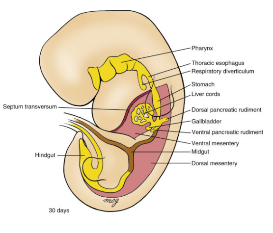
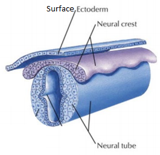
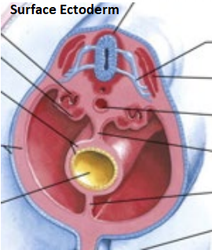
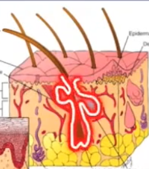
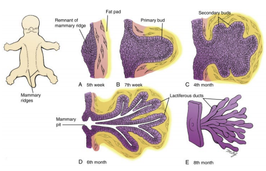

# Learning Outcomes
### Knowledge
1. Recognise or recall: **Identify, Name** or **List**
2. Brief description of major points: **Outline**
3. Strong understanding of major points: **Explain**
4. Detailed knowledge of all aspects and issues: **Discuss**
5. Higher level: **Apply** or **Analyse** or **Evaluate** or **Create**

- [Learning Outcomes](#learning-outcomes)
    - [Knowledge](#knowledge)
- [Population Health](#population-health)
    - [Describe population health frameworks and key concepts used in population health](#describe-population-health-frameworks-and-key-concepts-used-in-population-health)
    - [Outline the key causes of disease burden globally and in Australia](#outline-the-key-causes-of-disease-burden-globally-and-in-australia)
    - [Describe key concepts in migrant and refugee health](#describe-key-concepts-in-migrant-and-refugee-health)
    - [Describe key causes of displacement and the current global movements and resettlement patterns across the world](#describe-key-causes-of-displacement-and-the-current-global-movements-and-resettlement-patterns-across-the-world)
    - [Describe the health needs of asylum seekers, migrants, refugees and internally displaced persons](#describe-the-health-needs-of-asylum-seekers-migrants-refugees-and-internally-displaced-persons)
    - [Describe Australian resettlement policy and framework for assistance of refugees across the world](#describe-australian-resettlement-policy-and-framework-for-assistance-of-refugees-across-the-world)
- [Clinical Skills](#clinical-skills)
  - [Demonstrate Professionalism](#demonstrate-professionalism)
    - [Recognise and demonstrate the basic principles of professional behaviour in interactions with peers, patients and health professionals](#recognise-and-demonstrate-the-basic-principles-of-professional-behaviour-in-interactions-with-peers-patients-and-health-professionals)
    - [Demonstrate professional and clear communication skills in both verbal and written form](#demonstrate-professional-and-clear-communication-skills-in-both-verbal-and-written-form)
    - [Demonstrate the ability to establish rapport with patients and their families using verbal and nonverbal communication skills](#demonstrate-the-ability-to-establish-rapport-with-patients-and-their-families-using-verbal-and-nonverbal-communication-skills)
    - [Explain and apply the importance of maintaining patient confidentiality](#explain-and-apply-the-importance-of-maintaining-patient-confidentiality)
    - [Identify and apply the components of informed consent in history taking and physical examination settings](#identify-and-apply-the-components-of-informed-consent-in-history-taking-and-physical-examination-settings)
    - [Demonstrate the components of effective communication with other medical and allied health practitioners when discussing patient management](#demonstrate-the-components-of-effective-communication-with-other-medical-and-allied-health-practitioners-when-discussing-patient-management)
    - [Demonstrate the ability to work collaboratively and effectively with health professionals and other students within a team](#demonstrate-the-ability-to-work-collaboratively-and-effectively-with-health-professionals-and-other-students-within-a-team)
  - [Obtain an accurate, organized, logical and thorough history which differentiates among aetiologies of disease](#obtain-an-accurate-organized-logical-and-thorough-history-which-differentiates-among-aetiologies-of-disease)
    - [Formulate a problem list based on a patient's history](#formulate-a-problem-list-based-on-a-patients-history)
    - [Present the clinical history in a succint written and verbal format](#present-the-clinical-history-in-a-succint-written-and-verbal-format)
    - [Interpret findings from the patient history to select appropriate physical examinations](#interpret-findings-from-the-patient-history-to-select-appropriate-physical-examinations)
    - [Demonstrate the steps required for proper hand hygiene technique](#demonstrate-the-steps-required-for-proper-hand-hygiene-technique)
    - [Identify relevant surface anatomy and utilise this knowledge in physical examination](#identify-relevant-surface-anatomy-and-utilise-this-knowledge-in-physical-examination)
    - [Perform an accurate, organised and comprehensive physical examination and deliver a succint clinical presentation of findings](#perform-an-accurate-organised-and-comprehensive-physical-examination-and-deliver-a-succint-clinical-presentation-of-findings)
    - [Describe the evidence base for selected clinical examination signs](#describe-the-evidence-base-for-selected-clinical-examination-signs)
    - [Develop clinical reasoning skills by using pathophysiological principles (normal and abnormal structure, function, behaviour and development) to explain clinical symptoms and signs in each organ system](#develop-clinical-reasoning-skills-by-using-pathophysiological-principles-normal-and-abnormal-structure-function-behaviour-and-development-to-explain-clinical-symptoms-and-signs-in-each-organ-system)
    - [Use verbal communication, written documentation and electronic media to educate patients on the natural history of selected diseases in the relevant body systems](#use-verbal-communication-written-documentation-and-electronic-media-to-educate-patients-on-the-natural-history-of-selected-diseases-in-the-relevant-body-systems)
    - [Give and receive effective feedback on skills of communication, history taking and examination and modify performance as a result of feedback](#give-and-receive-effective-feedback-on-skills-of-communication-history-taking-and-examination-and-modify-performance-as-a-result-of-feedback)
- [Anatomy](#anatomy)
  - [Embryology](#embryology)
    - [Use the correct (quadrupedal) directional terms for describing structures relative to others in the embryo](#use-the-correct-quadrupedal-directional-terms-for-describing-structures-relative-to-others-in-the-embryo)
    - [Describe the developmental processes that take place in weeks 1-3, as demonstrated in this lecture](#describe-the-developmental-processes-that-take-place-in-weeks-1-3-as-demonstrated-in-this-lecture)
    - [Be able to identify and describe the anatomy of the early embryo & its primordia](#be-able-to-identify-and-describe-the-anatomy-of-the-early-embryo--its-primordia)
    - [Describe the 5 embryonic mechanisms used](#describe-the-5-embryonic-mechanisms-used)
    - [Identify embryological structures & cavities, knowing what they are derived from](#identify-embryological-structures--cavities-knowing-what-they-are-derived-from)
    - [Understand the development & the role played by the notochord](#understand-the-development--the-role-played-by-the-notochord)
    - [Understand & Describe how embryonic folding contributes to the formation of body cavities](#understand--describe-how-embryonic-folding-contributes-to-the-formation-of-body-cavities)
    - [Understand the partitioning of the coelomic cavity into its derivatives](#understand-the-partitioning-of-the-coelomic-cavity-into-its-derivatives)
    - [Understand the development of septum transversum and the diaphragm](#understand-the-development-of-septum-transversum-and-the-diaphragm)
    - [Explain the different structures and organs that are derived from each of the embryonic germ layers](#explain-the-different-structures-and-organs-that-are-derived-from-each-of-the-embryonic-germ-layers)
      - [Endoderm](#endoderm)
      - [Ectoderm](#ectoderm)
    - [Understand the derivatives of each different segment of ectoderm and how they developed in relation to neurulation and folding](#understand-the-derivatives-of-each-different-segment-of-ectoderm-and-how-they-developed-in-relation-to-neurulation-and-folding)
    - [Describe the specific contributions of the different types of mesoderm (somites, intermediate, lateral plate)](#describe-the-specific-contributions-of-the-different-types-of-mesoderm-somites-intermediate-lateral-plate)
    - [Define each of the four primary tissue types](#define-each-of-the-four-primary-tissue-types)
    - [Describe the different subtypes of each tissue type and where they can be found in the body](#describe-the-different-subtypes-of-each-tissue-type-and-where-they-can-be-found-in-the-body)
    - [Describe the respective properties of each subtype of tissue](#describe-the-respective-properties-of-each-subtype-of-tissue)
    - [Be able to identify different tissue types from micrograph images and specimens](#be-able-to-identify-different-tissue-types-from-micrograph-images-and-specimens)
    - [Differentiate cell and tissue types, whilst being able to justify your decision based on what is present and/or not present](#differentiate-cell-and-tissue-types-whilst-being-able-to-justify-your-decision-based-on-what-is-present-andor-not-present)
    - [Relate structure to function](#relate-structure-to-function)
    - [Define each type of epithelia and describe the respective functions/purpose of each](#define-each-type-of-epithelia-and-describe-the-respective-functionspurpose-of-each)
    - [Describe the different layers of tube structures and understand how they change with function/body site](#describe-the-different-layers-of-tube-structures-and-understand-how-they-change-with-functionbody-site)
    - [Describe the basic histological appearance of section of the nephron of the kidney](#describe-the-basic-histological-appearance-of-section-of-the-nephron-of-the-kidney)
    - [Describe the structure of blood tubes and how to identify/differentiate them](#describe-the-structure-of-blood-tubes-and-how-to-identifydifferentiate-them)
    - [Describe the different layers and types of skin and how to identify them](#describe-the-different-layers-and-types-of-skin-and-how-to-identify-them)
    - [Describe which embryological germ layer each epithelium is derived from](#describe-which-embryological-germ-layer-each-epithelium-is-derived-from)
- [Physiology](#physiology)
  - [Cellular Physiology](#cellular-physiology)
    - [Gain an understanding of the field of Physiology](#gain-an-understanding-of-the-field-of-physiology)
    - [Describe the level of organisation in the body](#describe-the-level-of-organisation-in-the-body)
    - [Know the constituents of the intracellular and extracellular environment](#know-the-constituents-of-the-intracellular-and-extracellular-environment)
    - [Discuss the concept of homeostasis and homeostatic control systems](#discuss-the-concept-of-homeostasis-and-homeostatic-control-systems)
    - [Know that multicellular life involves specialisation of individual cells and communication between cells](#know-that-multicellular-life-involves-specialisation-of-individual-cells-and-communication-between-cells)
    - [Describe and understand the forms of communication between cells](#describe-and-understand-the-forms-of-communication-between-cells)
    - [Describe the cellular level of organisation](#describe-the-cellular-level-of-organisation)
    - [List the main organelles and other major structures of a cell, describe their structure and explain their functions](#list-the-main-organelles-and-other-major-structures-of-a-cell-describe-their-structure-and-explain-their-functions)
    - [Develop an understanding of membrane structure and function](#develop-an-understanding-of-membrane-structure-and-function)
    - [Understand membrane permeability, diffusion, osmosis, osmolarity and tonicity](#understand-membrane-permeability-diffusion-osmosis-osmolarity-and-tonicity)
    - [Know the osmolarity of ICF and ECF](#know-the-osmolarity-of-icf-and-ecf)
    - [Understand passive diffusion, carrier mediated transport, primary and secondary active transport](#understand-passive-diffusion-carrier-mediated-transport-primary-and-secondary-active-transport)
    - [Understand how coupled transport enables the movement of solutes against an electrochemical gradient](#understand-how-coupled-transport-enables-the-movement-of-solutes-against-an-electrochemical-gradient)
    - [Understand exo and endo-cytosis](#understand-exo-and-endo-cytosis)
    - [Know the composition of different body fluid compartments](#know-the-composition-of-different-body-fluid-compartments)
    - [Explain the ionic basis of membrane potentials](#explain-the-ionic-basis-of-membrane-potentials)
    - [Describe & explain the ionic basis of electrical signaling in nerve and muscle cells (action potentials)](#describe--explain-the-ionic-basis-of-electrical-signaling-in-nerve-and-muscle-cells-action-potentials)
    - [Explain the process of sensory transduction](#explain-the-process-of-sensory-transduction)
    - [Describe how action potentials are propagated along membranes](#describe-how-action-potentials-are-propagated-along-membranes)
    - [Describe neurotransmitter & synaptic physiology](#describe-neurotransmitter--synaptic-physiology)
    - [List common neurotransmitters, their receptors and effects](#list-common-neurotransmitters-their-receptors-and-effects)
    - [Describe the processes involved in the regulated release of neurotransmitters](#describe-the-processes-involved-in-the-regulated-release-of-neurotransmitters)
    - [Outline the metablolism (production and destruction) of neurotransmitters](#outline-the-metablolism-production-and-destruction-of-neurotransmitters)
    - [Describe the formation of both IPSPs and EPSPs](#describe-the-formation-of-both-ipsps-and-epsps)
- [Biochemistry](#biochemistry)
    - [Name the cellular macromolecules, and have an understanding of their structure and function](#name-the-cellular-macromolecules-and-have-an-understanding-of-their-structure-and-function)
    - [Know the biologically important elements and which macromolecules they are in](#know-the-biologically-important-elements-and-which-macromolecules-they-are-in)
    - [Define an atom (including electron arrangement in shells), electron, neutron and proton](#define-an-atom-including-electron-arrangement-in-shells-electron-neutron-and-proton)
    - [Describe covalent and noncovalent bonds and give examples](#describe-covalent-and-noncovalent-bonds-and-give-examples)
    - [Have an understanding of the chemistry of carbon and its importance in organics](#have-an-understanding-of-the-chemistry-of-carbon-and-its-importance-in-organics)
    - [Have a general understanding of the different types of bonds and relative bond energies](#have-a-general-understanding-of-the-different-types-of-bonds-and-relative-bond-energies)
    - [Define polarity, chemistry and properties of water and its role in ionisation and hydration](#define-polarity-chemistry-and-properties-of-water-and-its-role-in-ionisation-and-hydration)
    - [Define concentration, mole and molarity](#define-concentration-mole-and-molarity)
    - [Describe the differences between acids and bases, and between strong/weak acids and bases](#describe-the-differences-between-acids-and-bases-and-between-strongweak-acids-and-bases)
    - [Define pH and know what physiological pH is](#define-ph-and-know-what-physiological-ph-is)
    - [Understand the role of buffers](#understand-the-role-of-buffers)
    - [Name and distinguish between organics such as alkanes, alkenes, alcohols, thiols, aldehydes, carboxylic acids, amines and aromatics](#name-and-distinguish-between-organics-such-as-alkanes-alkenes-alcohols-thiols-aldehydes-carboxylic-acids-amines-and-aromatics)
    - [Understand how conjugation in aromatic rings impacts structure and function](#understand-how-conjugation-in-aromatic-rings-impacts-structure-and-function)
    - [Recognise the functional groups given](#recognise-the-functional-groups-given)
    - [Have an understanding of the importance of isomers, particularly optical isomers](#have-an-understanding-of-the-importance-of-isomers-particularly-optical-isomers)
    - [Recognise carbohydrates and derivatives](#recognise-carbohydrates-and-derivatives)
    - [Recognise the structure and roles of glycerol, fatty acids, triacylglycerols, phospholipids and steroids](#recognise-the-structure-and-roles-of-glycerol-fatty-acids-triacylglycerols-phospholipids-and-steroids)
    - [Recognise that AA have chemical classifications, and know the basic and acidic AA names](#recognise-that-aa-have-chemical-classifications-and-know-the-basic-and-acidic-aa-names)
    - [Understand that AA are zwitterions and be able to draw their structure and different pHs](#understand-that-aa-are-zwitterions-and-be-able-to-draw-their-structure-and-different-phs)
    - [Understand and be able to draw and label components of peptides, and know levels of protein structure hierarchy, including bonds and structures therein](#understand-and-be-able-to-draw-and-label-components-of-peptides-and-know-levels-of-protein-structure-hierarchy-including-bonds-and-structures-therein)
    - [Define prosthetic groups, simple, conjugated, fibrous globular, native and denatured proteins](#define-prosthetic-groups-simple-conjugated-fibrous-globular-native-and-denatured-proteins)
    - [Know the general functions of proteins](#know-the-general-functions-of-proteins)
    - [Understand that proteins bind ligands](#understand-that-proteins-bind-ligands)
    - [Have a basic understanding of metabolism & energetics of reactions](#have-a-basic-understanding-of-metabolism--energetics-of-reactions)
    - [Know the meaning of: free energy, substrate, product, active site, transition state, activation energy, endergonic reaction, exergonic reaction, energy transfer](#know-the-meaning-of-free-energy-substrate-product-active-site-transition-state-activation-energy-endergonic-reaction-exergonic-reaction-energy-transfer)
    - [Have a basic understanding of cellular energy and ATP's role in the cell](#have-a-basic-understanding-of-cellular-energy-and-atps-role-in-the-cell)
    - [Have an understanding of enzymes as catalysts and of the mechanism of enzyme action in cells](#have-an-understanding-of-enzymes-as-catalysts-and-of-the-mechanism-of-enzyme-action-in-cells)
    - [Understand the impact on enzyme activity of temperature, pH, substrate concentration](#understand-the-impact-on-enzyme-activity-of-temperature-ph-substrate-concentration)
    - [Understand the need for controlling enzyme activity, including: allosterism, inhibitors, inhibition and feedback](#understand-the-need-for-controlling-enzyme-activity-including-allosterism-inhibitors-inhibition-and-feedback)
    - [Appreciate the role of enzymes, pathways, "high energy" carriers, cofactors & coenzymes in metabolism](#appreciate-the-role-of-enzymes-pathways-high-energy-carriers-cofactors--coenzymes-in-metabolism)
    - [Know the general classes of enzymes and their functions](#know-the-general-classes-of-enzymes-and-their-functions)
    - [Understand redox reactions and the role of redox reactions in metabolism](#understand-redox-reactions-and-the-role-of-redox-reactions-in-metabolism)
    - [Know that NADH & FADH2 are important electron carriers](#know-that-nadh--fadh2-are-important-electron-carriers)
    - [Understand the significance of Redox Potential values](#understand-the-significance-of-redox-potential-values)
    - [Understand reduced bonds and realise that many of our metabolic pathways are oxidative](#understand-reduced-bonds-and-realise-that-many-of-our-metabolic-pathways-are-oxidative)
    - [Have a general understanding of metabolism, the need for integration of metabolism and the sharing of metabolic roles within the body](#have-a-general-understanding-of-metabolism-the-need-for-integration-of-metabolism-and-the-sharing-of-metabolic-roles-within-the-body)
- [CAMDH](#camdh)
    - [Describe the cultural diversity within the Aboriginal Population](#describe-the-cultural-diversity-within-the-aboriginal-population)
    - [Discuss the cultural determinants and how they influence health in Aboriginal people and Communities](#discuss-the-cultural-determinants-and-how-they-influence-health-in-aboriginal-people-and-communities)
    - [Understand Aboriginal culture from a strength-based perspective](#understand-aboriginal-culture-from-a-strength-based-perspective)
- [Pathology](#pathology)
    - [Know, understand and discuss the important and common diseases (`core conditions`)](#know-understand-and-discuss-the-important-and-common-diseases-core-conditions)
    - [Demonstrate and apply knowledge of general pathological processes and specific diseases in clinically relevant contexts](#demonstrate-and-apply-knowledge-of-general-pathological-processes-and-specific-diseases-in-clinically-relevant-contexts)
    - [Define important terms including: pathology, disease, pathogenesis, aetiology, sign, symptom, test, risk factor, complication and others outlined in the lectures](#define-important-terms-including-pathology-disease-pathogenesis-aetiology-sign-symptom-test-risk-factor-complication-and-others-outlined-in-the-lectures)
    - [Be able to list the basic pathological processes that underpin more complex diseases](#be-able-to-list-the-basic-pathological-processes-that-underpin-more-complex-diseases)
    - [Describe ways that disease can be classified, the terminology associated with classification, and why classification is important](#describe-ways-that-disease-can-be-classified-the-terminology-associated-with-classification-and-why-classification-is-important)
    - [Understand how knowledge of pathology, pathogenesis and aetiology of disease can be utilised in patient care](#understand-how-knowledge-of-pathology-pathogenesis-and-aetiology-of-disease-can-be-utilised-in-patient-care)
    - [Be aware of the different branches of pathology as a clinical and diagnostic discipline and understand the range of tools available for use by pathologists](#be-aware-of-the-different-branches-of-pathology-as-a-clinical-and-diagnostic-discipline-and-understand-the-range-of-tools-available-for-use-by-pathologists)
- [Need the learning outcomes for the Path lectures in week 2 after marcus](#need-the-learning-outcomes-for-the-path-lectures-in-week-2-after-marcus)
- [Microbiology](#microbiology)
- [Behavioural Science](#behavioural-science)
    - [Discuss patient-centred care and its relevance to health outcomes](#discuss-patient-centred-care-and-its-relevance-to-health-outcomes)
    - [Explore the patient experience of illness including the impact of the medical condition on the patient and their support network](#explore-the-patient-experience-of-illness-including-the-impact-of-the-medical-condition-on-the-patient-and-their-support-network)
    - [Describe basic communication and interviewing skills required to conduct a doctor-patient interview, including: asking questions; attentive and active listening; facilitation; clarification; silence and reflection; and summarising](#describe-basic-communication-and-interviewing-skills-required-to-conduct-a-doctor-patient-interview-including-asking-questions-attentive-and-active-listening-facilitation-clarification-silence-and-reflection-and-summarising)
    - [Understand the importance of positive and negative verbal and non-verbal communication in doctor-patient communication](#understand-the-importance-of-positive-and-negative-verbal-and-non-verbal-communication-in-doctor-patient-communication)
- [Health Humanities](#health-humanities)
    - [Discuss historical perspectives of health and its relation to changing beliefs and scientific understanding](#discuss-historical-perspectives-of-health-and-its-relation-to-changing-beliefs-and-scientific-understanding)
    - [Explore social construction of health and wellness today](#explore-social-construction-of-health-and-wellness-today)
    - [Discuss determinants of health](#discuss-determinants-of-health)
    - [Describe the changing role of the patient](#describe-the-changing-role-of-the-patient)

# Population Health

### Describe population health frameworks and key concepts used in population health

### Outline the key causes of disease burden globally and in Australia
### Describe key concepts in migrant and refugee health
### Describe key causes of displacement and the current global movements and resettlement patterns across the world
### Describe the health needs of asylum seekers, migrants, refugees and internally displaced persons
### Describe Australian resettlement policy and framework for assistance of refugees across the world


---------------------

# Clinical Skills

## Demonstrate Professionalism

### Recognise and demonstrate the basic principles of professional behaviour in interactions with peers, patients and health professionals

### Demonstrate professional and clear communication skills in both verbal and written form

### Demonstrate the ability to establish rapport with patients and their families using verbal and nonverbal communication skills

### Explain and apply the importance of maintaining patient confidentiality

### Identify and apply the components of informed consent in history taking and physical examination settings

### Demonstrate the components of effective communication with other medical and allied health practitioners when discussing patient management

### Demonstrate the ability to work collaboratively and effectively with health professionals and other students within a team

## Obtain an accurate, organized, logical and thorough history which differentiates among aetiologies of disease

### Formulate a problem list based on a patient's history

### Present the clinical history in a succint written and verbal format

### Interpret findings from the patient history to select appropriate physical examinations

### Demonstrate the steps required for proper hand hygiene technique

### Identify relevant surface anatomy and utilise this knowledge in physical examination

### Perform an accurate, organised and comprehensive physical examination and deliver a succint clinical presentation of findings

### Describe the evidence base for selected clinical examination signs

### Develop clinical reasoning skills by using pathophysiological principles (normal and abnormal structure, function, behaviour and development) to explain clinical symptoms and signs in each organ system

### Use verbal communication, written documentation and electronic media to educate patients on the natural history of selected diseases in the relevant body systems

### Give and receive effective feedback on skills of communication, history taking and examination and modify performance as a result of feedback

# Anatomy
<!-- Embryology -->
## Embryology
### Use the correct (quadrupedal) directional terms for describing structures relative to others in the embryo

|Directional Term| Description|Opposite Term|Description|
|-:|:-:|-:|:-:|
|Ventral|Towards the belly|Dorsal|Towards the back|
|Cranial|Towards the head|Caudal|Towards the tail|
|Anterior|See Cranial|Posterior|See Caudal|
|Proximal|Closer to the body|Distal|Further from the body|
|Transverse Plane|Divides body into Cranial and Caudal sections|||
|Frontal Plane|Divides body into Ventral and Dorsal sections|||
|Sagittal Plane|Divides body into L and R sections|||

### Describe the developmental processes that take place in weeks 1-3, as demonstrated in this lecture

### Be able to identify and describe the anatomy of the early embryo & its primordia

### Describe the 5 embryonic mechanisms used
|Embryonic Mechanism|Description|
|-:|:-|
|Proliferation|Growth in number of cells|
|Migration|Movement of cells from one area to another|
|Differentiation|Alteration of a cells own developmental trajectory|
|Induction|Signalling neighbouring cells to differentiate|
|Combination|Combination of cells from different germ layers to form organs|


### Identify embryological structures & cavities, knowing what they are derived from

### Understand the development & the role played by the notochord

### Understand & Describe how embryonic folding contributes to the formation of body cavities
### Understand the partitioning of the coelomic cavity into its derivatives
### Understand the development of septum transversum and the diaphragm
### Explain the different structures and organs that are derived from each of the embryonic germ layers
#### Endoderm
| Structure | Description     |
| :-------: | :-------------- |
| Gut Tube  | Epithelium only |
|Appendages of the Gut Tube<br/>           ||
|Respiratory|The conductive airways through from the larynx through into the lungs|
|Liver & Gall Bladder|
|Pancreas|
|Urinary Bladder| Occurs after GIT differentiates from the urogenital system|



#### Ectoderm

|Derivative|Structure|
|:-:|:-|
|Surface Ectoderm (SE)|[Epidermis](#epidermis)|
|Neural Tube Ectoderm (NT)||
|Neural Crest Cells (NCC)||

**Epidermis**<a name="epidermis"></a>
- Derived from the **Somatopleure**. `Somato = Body | Pleure = Wall`
  - Component of surface ectoderm with a component of lateral plate mesoderm
- Most exposed component
  - Protective
  - Interactive
    - Hair, sweating etc
- **Epidermal Appendages** <br/> ```Develop from the Ectoderm, but has embed itself in the Mesoderm (Dermis)```
  - Hair follicles and sebaceous glands
  - Finger Nails
  - Mammary glands
    - Proliferate -> Form buds -> Canalisation (duct system forming within)
    - The secreting tissue of the Mammary tissue is derived from Ectoderm
      - The surrounding tissue is derived from the Mesoderm
- **Water proofing**
  - Keratinised cells provide a layer of dead cell protection
    - Water proofing (hydrophobic)
    - Barrier for infection


>TODO
>- [ ] Format and caption the images
>
>





### Understand the derivatives of each different segment of ectoderm and how they developed in relation to neurulation and folding
[See Ectoderm structures above](#ectoderm)
### Describe the specific contributions of the different types of mesoderm (somites, intermediate, lateral plate)
### Define each of the four primary tissue types
|Primary Tissue Type|Definition|
|-:|:-|
|Epithelium|
|Connective|
|Muscle|
|Nervous|

### Describe the different subtypes of each tissue type and where they can be found in the body

|Type|Description|Where?|Image|
|:-:|:-|:-:|:-:|
|**Epithelial Tissues**||||
|Simple Squamous|
|Simple Cuboidal|
|Simple Columnar|
|Stratified Squamous|
|Stratified Cuboidal|
|PseudostratifiedColumnar|
|Transitional|
|**Connective Tissues**||||
|Dense Connective Tissue|
|Loose Connective Tissue|
|Reticular Connective Tissue|
|Cartilage|
|Bone|
|Blood|
|Adipose Tissue|
|Embryonic Connective Tissue|
|**Muscular Tissues**||||
|Skeletal Muscle|
|Smooth Muscle|
|Cardiovascular Muscle|
|**Nervous Tissues**||||
|Neurons|
|Neuroglia|


### Describe the respective properties of each subtype of tissue
|Type|Properties|
|:-:|:-|
|**Epithelial Tissues**||
|Simple Squamous|
|Simple Cuboidal|
|Simple Columnar|
|Stratified Squamous|
|Stratified Cuboidal|
|PseudostratifiedColumnar|
|Transitional|
|**Connective Tissues**||
|Dense Connective Tissue|
|Loose Connective Tissue|
|Reticular Connective Tissue|
|Cartilage|
|Bone|
|Blood|
|Adipose Tissue|
|Embryonic Connective Tissue|
|**Muscular Tissues**||
|Skeletal Muscle|
|Smooth Muscle|
|Cardiovascular Muscle|
|**Nervous Tissues**||
|Neurons|
|Neuroglia|

### Be able to identify different tissue types from micrograph images and specimens
### Differentiate cell and tissue types, whilst being able to justify your decision based on what is present and/or not present
### Relate structure to function
### Define each type of epithelia and describe the respective functions/purpose of each
### Describe the different layers of tube structures and understand how they change with function/body site
### Describe the basic histological appearance of section of the nephron of the kidney
### Describe the structure of blood tubes and how to identify/differentiate them
### Describe the different layers and types of skin and how to identify them
### Describe which embryological germ layer each epithelium is derived from


# Physiology
## Cellular Physiology

### Gain an understanding of the field of Physiology

### Describe the level of organisation in the body
### Know the constituents of the intracellular and extracellular environment
### Discuss the concept of homeostasis and homeostatic control systems
### Know that multicellular life involves specialisation of individual cells and communication between cells
### Describe and understand the forms of communication between cells
### Describe the cellular level of organisation
### List the main organelles and other major structures of a cell, describe their structure and explain their functions
### Develop an understanding of membrane structure and function
### Understand membrane permeability, diffusion, osmosis, osmolarity and tonicity
### Know the osmolarity of ICF and ECF
### Understand passive diffusion, carrier mediated transport, primary and secondary active transport
### Understand how coupled transport enables the movement of solutes against an electrochemical gradient
### Understand exo and endo-cytosis
### Know the composition of different body fluid compartments
### Explain the ionic basis of membrane potentials
### Describe & explain the ionic basis of electrical signaling in nerve and muscle cells (action potentials)
### Explain the process of sensory transduction
### Describe how action potentials are propagated along membranes
### Describe neurotransmitter & synaptic physiology
### List common neurotransmitters, their receptors and effects
### Describe the processes involved in the regulated release of neurotransmitters
### Outline the metablolism (production and destruction) of neurotransmitters
### Describe the formation of both IPSPs and EPSPs

# Biochemistry

### Name the cellular macromolecules, and have an understanding of their structure and function
### Know the biologically important elements and which macromolecules they are in
### Define an atom (including electron arrangement in shells), electron, neutron and proton
### Describe covalent and noncovalent bonds and give examples
### Have an understanding of the chemistry of carbon and its importance in organics
### Have a general understanding of the different types of bonds and relative bond energies
### Define polarity, chemistry and properties of water and its role in ionisation and hydration
### Define concentration, mole and molarity
### Describe the differences between acids and bases, and between strong/weak acids and bases
### Define pH and know what physiological pH is
### Understand the role of buffers
### Name and distinguish between organics such as alkanes, alkenes, alcohols, thiols, aldehydes, carboxylic acids, amines and aromatics
### Understand how conjugation in aromatic rings impacts structure and function
### Recognise the functional groups given
### Have an understanding of the importance of isomers, particularly optical isomers
### Recognise carbohydrates and derivatives
### Recognise the structure and roles of glycerol, fatty acids, triacylglycerols, phospholipids and steroids
### Recognise that AA have chemical classifications, and know the basic and acidic AA names
### Understand that AA are zwitterions and be able to draw their structure and different pHs
### Understand and be able to draw and label components of peptides, and know levels of protein structure hierarchy, including bonds and structures therein
### Define prosthetic groups, simple, conjugated, fibrous globular, native and denatured proteins
### Know the general functions of proteins
### Understand that proteins bind ligands
### Have a basic understanding of metabolism & energetics of reactions
### Know the meaning of: free energy, substrate, product, active site, transition state, activation energy, endergonic reaction, exergonic reaction, energy transfer
### Have a basic understanding of cellular energy and ATP's role in the cell
### Have an understanding of enzymes as catalysts and of the mechanism of enzyme action in cells
### Understand the impact on enzyme activity of temperature, pH, substrate concentration
### Understand the need for controlling enzyme activity, including: allosterism, inhibitors, inhibition and feedback
### Appreciate the role of enzymes, pathways, "high energy" carriers, cofactors & coenzymes in metabolism
### Know the general classes of enzymes and their functions
### Understand redox reactions and the role of redox reactions in metabolism
### Know that NADH & FADH2 are important electron carriers
### Understand the significance of Redox Potential values
### Understand reduced bonds and realise that many of our metabolic pathways are oxidative
### Have a general understanding of metabolism, the need for integration of metabolism and the sharing of metabolic roles within the body


# CAMDH

### Describe the cultural diversity within the Aboriginal Population
### Discuss the cultural determinants and how they influence health in Aboriginal people and Communities
### Understand Aboriginal culture from a strength-based perspective

# Pathology

### Know, understand and discuss the important and common diseases (`core conditions`)

### Demonstrate and apply knowledge of general pathological processes and specific diseases in clinically relevant contexts

### Define important terms including: pathology, disease, pathogenesis, aetiology, sign, symptom, test, risk factor, complication and others outlined in the lectures
### Be able to list the basic pathological processes that underpin more complex diseases
### Describe ways that disease can be classified, the terminology associated with classification, and why classification is important
### Understand how knowledge of pathology, pathogenesis and aetiology of disease can be utilised in patient care
### Be aware of the different branches of pathology as a clinical and diagnostic discipline and understand the range of tools available for use by pathologists

<!-- ### Describe pathology in terms of where it is, lesion descriptions -->
# Need the learning outcomes for the Path lectures in week 2 after marcus

# Microbiology

# Behavioural Science

### Discuss patient-centred care and its relevance to health outcomes
### Explore the patient experience of illness including the impact of the medical condition on the patient and their support network
### Describe basic communication and interviewing skills required to conduct a doctor-patient interview, including: asking questions; attentive and active listening; facilitation; clarification; silence and reflection; and summarising
### Understand the importance of positive and negative verbal and non-verbal communication in doctor-patient communication


# Health Humanities

### Discuss historical perspectives of health and its relation to changing beliefs and scientific understanding
### Explore social construction of health and wellness today
### Discuss determinants of health
### Describe the changing role of the patient

