# Introduction

> :grey_exclamation: This document is an accumulation of the Learning Outcomes presented **primarily** in the lectures.

> :exclamation: There is no guarantee the content contained is correct. Please advise if you do notice something incorrect however.

:beginner: Author: Shayan Habibi

# Learning Outcomes
### Knowledge
1. Recognise or recall: **Identify, Name** or **List**
2. Brief description of major points: **Outline**
3. Strong understanding of major points: **Explain**
4. Detailed knowledge of all aspects and issues: **Discuss**
5. Higher level: **Apply** or **Analyse** or **Evaluate** or **Create**

- [Introduction](#introduction)
- [Learning Outcomes](#learning-outcomes)
    - [Knowledge](#knowledge)
- [Population Health](#population-health)
    - [Describe population health frameworks and key concepts used in population health](#describe-population-health-frameworks-and-key-concepts-used-in-population-health)
    - [Outline the key causes of disease burden globally and in Australia](#outline-the-key-causes-of-disease-burden-globally-and-in-australia)
    - [Describe key concepts in migrant and refugee health](#describe-key-concepts-in-migrant-and-refugee-health)
    - [Describe key causes of displacement and the current global movements and resettlement patterns across the world](#describe-key-causes-of-displacement-and-the-current-global-movements-and-resettlement-patterns-across-the-world)
    - [Describe the health needs of asylum seekers, migrants, refugees and internally displaced persons](#describe-the-health-needs-of-asylum-seekers-migrants-refugees-and-internally-displaced-persons)
    - [Describe Australian resettlement policy and framework for assistance of refugees across the world](#describe-australian-resettlement-policy-and-framework-for-assistance-of-refugees-across-the-world)
- [Clinical Skills](#clinical-skills)
  - [Demonstrate Professionalism](#demonstrate-professionalism)
    - [Recognise and demonstrate the basic principles of professional behaviour in interactions with peers, patients and health professionals](#recognise-and-demonstrate-the-basic-principles-of-professional-behaviour-in-interactions-with-peers-patients-and-health-professionals)
    - [Demonstrate professional and clear communication skills in both verbal and written form](#demonstrate-professional-and-clear-communication-skills-in-both-verbal-and-written-form)
    - [Demonstrate the ability to establish rapport with patients and their families using verbal and nonverbal communication skills](#demonstrate-the-ability-to-establish-rapport-with-patients-and-their-families-using-verbal-and-nonverbal-communication-skills)
    - [Explain and apply the importance of maintaining patient confidentiality](#explain-and-apply-the-importance-of-maintaining-patient-confidentiality)
    - [Identify and apply the components of informed consent in history taking and physical examination settings](#identify-and-apply-the-components-of-informed-consent-in-history-taking-and-physical-examination-settings)
    - [Demonstrate the components of effective communication with other medical and allied health practitioners when discussing patient management](#demonstrate-the-components-of-effective-communication-with-other-medical-and-allied-health-practitioners-when-discussing-patient-management)
    - [Demonstrate the ability to work collaboratively and effectively with health professionals and other students within a team](#demonstrate-the-ability-to-work-collaboratively-and-effectively-with-health-professionals-and-other-students-within-a-team)
  - [Obtain an accurate, organized, logical and thorough history which differentiates among aetiologies of disease](#obtain-an-accurate-organized-logical-and-thorough-history-which-differentiates-among-aetiologies-of-disease)
    - [Formulate a problem list based on a patient's history](#formulate-a-problem-list-based-on-a-patients-history)
    - [Present the clinical history in a succint written and verbal format](#present-the-clinical-history-in-a-succint-written-and-verbal-format)
    - [Interpret findings from the patient history to select appropriate physical examinations](#interpret-findings-from-the-patient-history-to-select-appropriate-physical-examinations)
    - [Demonstrate the steps required for proper hand hygiene technique](#demonstrate-the-steps-required-for-proper-hand-hygiene-technique)
    - [Identify relevant surface anatomy and utilise this knowledge in physical examination](#identify-relevant-surface-anatomy-and-utilise-this-knowledge-in-physical-examination)
    - [Perform an accurate, organised and comprehensive physical examination and deliver a succint clinical presentation of findings](#perform-an-accurate-organised-and-comprehensive-physical-examination-and-deliver-a-succint-clinical-presentation-of-findings)
    - [Describe the evidence base for selected clinical examination signs](#describe-the-evidence-base-for-selected-clinical-examination-signs)
    - [Develop clinical reasoning skills by using pathophysiological principles (normal and abnormal structure, function, behaviour and development) to explain clinical symptoms and signs in each organ system](#develop-clinical-reasoning-skills-by-using-pathophysiological-principles-normal-and-abnormal-structure-function-behaviour-and-development-to-explain-clinical-symptoms-and-signs-in-each-organ-system)
    - [Use verbal communication, written documentation and electronic media to educate patients on the natural history of selected diseases in the relevant body systems](#use-verbal-communication-written-documentation-and-electronic-media-to-educate-patients-on-the-natural-history-of-selected-diseases-in-the-relevant-body-systems)
    - [Give and receive effective feedback on skills of communication, history taking and examination and modify performance as a result of feedback](#give-and-receive-effective-feedback-on-skills-of-communication-history-taking-and-examination-and-modify-performance-as-a-result-of-feedback)
- [Anatomy](#anatomy)
  - [Embryology](#embryology)
    - [Use the correct (quadrupedal) directional terms for describing structures relative to others in the embryo](#use-the-correct-quadrupedal-directional-terms-for-describing-structures-relative-to-others-in-the-embryo)
    - [Describe the developmental processes that take place in weeks 1-3, as demonstrated in this lecture](#describe-the-developmental-processes-that-take-place-in-weeks-1-3-as-demonstrated-in-this-lecture)
    - [Be able to identify and describe the anatomy of the early embryo & its primordia](#be-able-to-identify-and-describe-the-anatomy-of-the-early-embryo--its-primordia)
    - [Describe the 5 embryonic mechanisms used](#describe-the-5-embryonic-mechanisms-used)
    - [Identify embryological structures & cavities, knowing what they are derived from](#identify-embryological-structures--cavities-knowing-what-they-are-derived-from)
    - [Understand the development & the role played by the notochord](#understand-the-development--the-role-played-by-the-notochord)
    - [Understand & Describe how embryonic folding contributes to the formation of body cavities](#understand--describe-how-embryonic-folding-contributes-to-the-formation-of-body-cavities)
    - [Understand the partitioning of the coelomic cavity into its derivatives](#understand-the-partitioning-of-the-coelomic-cavity-into-its-derivatives)
    - [Understand the development of septum transversum and the diaphragm](#understand-the-development-of-septum-transversum-and-the-diaphragm)
    - [Explain the different structures and organs that are derived from each of the embryonic germ layers](#explain-the-different-structures-and-organs-that-are-derived-from-each-of-the-embryonic-germ-layers)
      - [Endoderm](#endoderm)
      - [Ectoderm](#ectoderm)
      - [Mesoderm](#mesoderm)
    - [Understand the derivatives of each different segment of ectoderm and how they developed in relation to neurulation and folding](#understand-the-derivatives-of-each-different-segment-of-ectoderm-and-how-they-developed-in-relation-to-neurulation-and-folding)
      - [**Surface Ectoderm: Epidermis**<a name="epidermis"></a>](#surface-ectoderm-epidermis)
      - [**Surface Ectoderm: Rathke's Pouch**<a name="rathkes-pouch"></a>](#surface-ectoderm-rathkes-pouch)
      - [**Surface Ectoderm: 'Seek and Destroy' Organs**<a name="seek-destroy-organs"></a>](#surface-ectoderm-seek-and-destroy-organs)
      - [**Neural Tube: Central Nervous System**<a name="cns"></a>](#neural-tube-central-nervous-system)
      - [**Neural Crest: Peripheral Nervous System**<a name="pns"></a>](#neural-crest-peripheral-nervous-system)
      - [**Neural Crest: Dorsal Root Ganglion**<a name="drg"></a>](#neural-crest-dorsal-root-ganglion)
      - [**Neural Crest: Autonomic Ganglion**<a name="ag"></a>](#neural-crest-autonomic-ganglion)
      - [**Neural Crest: Adrenal Medulla**<a name="am"></a>](#neural-crest-adrenal-medulla)
    - [Describe the specific contributions of the different types of mesoderm (somites, intermediate, lateral plate)](#describe-the-specific-contributions-of-the-different-types-of-mesoderm-somites-intermediate-lateral-plate)
      - [Paraxial Mesoderm](#paraxial-mesoderm)
      - [Intermediate Mesoderm](#intermediate-mesoderm)
      - [Lateral Plate Mesoderm](#lateral-plate-mesoderm)
    - [Define each of the four primary tissue types](#define-each-of-the-four-primary-tissue-types)
    - [Describe the different subtypes of each tissue type and where they can be found in the body](#describe-the-different-subtypes-of-each-tissue-type-and-where-they-can-be-found-in-the-body)
    - [Describe the respective properties of each subtype of tissue](#describe-the-respective-properties-of-each-subtype-of-tissue)
    - [Be able to identify different tissue types from micrograph images and specimens](#be-able-to-identify-different-tissue-types-from-micrograph-images-and-specimens)
    - [Differentiate cell and tissue types, whilst being able to justify your decision based on what is present and/or not present](#differentiate-cell-and-tissue-types-whilst-being-able-to-justify-your-decision-based-on-what-is-present-andor-not-present)
    - [Relate structure to function](#relate-structure-to-function)
    - [Define each type of epithelia and describe the respective functions/purpose of each](#define-each-type-of-epithelia-and-describe-the-respective-functionspurpose-of-each)
    - [Describe the different layers of tube structures and understand how they change with function/body site](#describe-the-different-layers-of-tube-structures-and-understand-how-they-change-with-functionbody-site)
    - [Describe the basic histological appearance of section of the nephron of the kidney](#describe-the-basic-histological-appearance-of-section-of-the-nephron-of-the-kidney)
    - [Describe the structure of blood tubes and how to identify/differentiate them](#describe-the-structure-of-blood-tubes-and-how-to-identifydifferentiate-them)
    - [Describe the different layers and types of skin and how to identify them](#describe-the-different-layers-and-types-of-skin-and-how-to-identify-them)
    - [Describe which embryological germ layer each epithelium is derived from](#describe-which-embryological-germ-layer-each-epithelium-is-derived-from)
- [Physiology](#physiology)
  - [Cellular Physiology](#cellular-physiology)
    - [Gain an understanding of the field of Physiology](#gain-an-understanding-of-the-field-of-physiology)
    - [Describe the level of organisation in the body](#describe-the-level-of-organisation-in-the-body)
    - [Know the constituents of the intracellular and extracellular environment](#know-the-constituents-of-the-intracellular-and-extracellular-environment)
    - [Discuss the concept of homeostasis and homeostatic control systems](#discuss-the-concept-of-homeostasis-and-homeostatic-control-systems)
    - [Know that multicellular life involves specialisation of individual cells and communication between cells](#know-that-multicellular-life-involves-specialisation-of-individual-cells-and-communication-between-cells)
    - [Describe and understand the forms of communication between cells](#describe-and-understand-the-forms-of-communication-between-cells)
  - [:label: Very common](#label-very-common)
  - [:label: Very common](#label-very-common-1)
    - [Describe the cellular level of organisation](#describe-the-cellular-level-of-organisation)
    - [List the main organelles and other major structures of a cell, describe their structure and explain their functions](#list-the-main-organelles-and-other-major-structures-of-a-cell-describe-their-structure-and-explain-their-functions)
    - [Develop an understanding of membrane structure and function](#develop-an-understanding-of-membrane-structure-and-function)
    - [Understand membrane permeability, diffusion, osmosis, osmolarity and tonicity](#understand-membrane-permeability-diffusion-osmosis-osmolarity-and-tonicity)
    - [Know the osmolarity of ICF and ECF](#know-the-osmolarity-of-icf-and-ecf)
    - [Understand passive diffusion, carrier mediated transport, primary and secondary active transport](#understand-passive-diffusion-carrier-mediated-transport-primary-and-secondary-active-transport)
    - [Understand how coupled transport enables the movement of solutes against an electrochemical gradient](#understand-how-coupled-transport-enables-the-movement-of-solutes-against-an-electrochemical-gradient)
    - [Understand exo and endo-cytosis](#understand-exo-and-endo-cytosis)
    - [Know the composition of different body fluid compartments](#know-the-composition-of-different-body-fluid-compartments)
    - [Explain the ionic basis of membrane potentials](#explain-the-ionic-basis-of-membrane-potentials)
    - [Describe & explain the ionic basis of electrical signaling in nerve and muscle cells (action potentials)](#describe--explain-the-ionic-basis-of-electrical-signaling-in-nerve-and-muscle-cells-action-potentials)
    - [Explain the process of sensory transduction](#explain-the-process-of-sensory-transduction)
    - [Describe how action potentials are propagated along membranes](#describe-how-action-potentials-are-propagated-along-membranes)
    - [Describe neurotransmitter & synaptic physiology](#describe-neurotransmitter--synaptic-physiology)
    - [List common neurotransmitters, their receptors and effects](#list-common-neurotransmitters-their-receptors-and-effects)
    - [Describe the processes involved in the regulated release of neurotransmitters](#describe-the-processes-involved-in-the-regulated-release-of-neurotransmitters)
    - [Outline the metablolism (production and destruction) of neurotransmitters](#outline-the-metablolism-production-and-destruction-of-neurotransmitters)
    - [Describe the formation of both IPSPs and EPSPs](#describe-the-formation-of-both-ipsps-and-epsps)
- [Biochemistry](#biochemistry)
    - [Name the cellular macromolecules, and have an understanding of their structure and function](#name-the-cellular-macromolecules-and-have-an-understanding-of-their-structure-and-function)
    - [Know the biologically important elements and which macromolecules they are in](#know-the-biologically-important-elements-and-which-macromolecules-they-are-in)
    - [Define an atom (including electron arrangement in shells), electron, neutron and proton](#define-an-atom-including-electron-arrangement-in-shells-electron-neutron-and-proton)
    - [Describe covalent and noncovalent bonds and give examples](#describe-covalent-and-noncovalent-bonds-and-give-examples)
    - [Have an understanding of the chemistry of carbon and its importance in organics](#have-an-understanding-of-the-chemistry-of-carbon-and-its-importance-in-organics)
    - [Have a general understanding of the different types of bonds and relative bond energies](#have-a-general-understanding-of-the-different-types-of-bonds-and-relative-bond-energies)
    - [Define polarity, chemistry and properties of water and its role in ionisation and hydration](#define-polarity-chemistry-and-properties-of-water-and-its-role-in-ionisation-and-hydration)
    - [Define concentration, mole and molarity](#define-concentration-mole-and-molarity)
    - [Describe the differences between acids and bases, and between strong/weak acids and bases](#describe-the-differences-between-acids-and-bases-and-between-strongweak-acids-and-bases)
    - [Define pH and know what physiological pH is](#define-ph-and-know-what-physiological-ph-is)
    - [Understand the role of buffers](#understand-the-role-of-buffers)
    - [Name and distinguish between organics such as alkanes, alkenes, alcohols, thiols, aldehydes, carboxylic acids, amines and aromatics](#name-and-distinguish-between-organics-such-as-alkanes-alkenes-alcohols-thiols-aldehydes-carboxylic-acids-amines-and-aromatics)
    - [Understand how conjugation in aromatic rings impacts structure and function](#understand-how-conjugation-in-aromatic-rings-impacts-structure-and-function)
    - [Recognise the functional groups given](#recognise-the-functional-groups-given)
    - [Have an understanding of the importance of isomers, particularly optical isomers](#have-an-understanding-of-the-importance-of-isomers-particularly-optical-isomers)
    - [Recognise carbohydrates and derivatives](#recognise-carbohydrates-and-derivatives)
    - [Recognise the structure and roles of glycerol, fatty acids, triacylglycerols, phospholipids and steroids](#recognise-the-structure-and-roles-of-glycerol-fatty-acids-triacylglycerols-phospholipids-and-steroids)
    - [Recognise that AA have chemical classifications, and know the basic and acidic AA names](#recognise-that-aa-have-chemical-classifications-and-know-the-basic-and-acidic-aa-names)
    - [Understand that AA are zwitterions and be able to draw their structure and different pHs](#understand-that-aa-are-zwitterions-and-be-able-to-draw-their-structure-and-different-phs)
    - [Understand and be able to draw and label components of peptides, and know levels of protein structure hierarchy, including bonds and structures therein](#understand-and-be-able-to-draw-and-label-components-of-peptides-and-know-levels-of-protein-structure-hierarchy-including-bonds-and-structures-therein)
    - [Define prosthetic groups, simple, conjugated, fibrous globular, native and denatured proteins](#define-prosthetic-groups-simple-conjugated-fibrous-globular-native-and-denatured-proteins)
    - [Know the general functions of proteins](#know-the-general-functions-of-proteins)
    - [Understand that proteins bind ligands](#understand-that-proteins-bind-ligands)
    - [Have a basic understanding of metabolism & energetics of reactions](#have-a-basic-understanding-of-metabolism--energetics-of-reactions)
    - [Know the meaning of: free energy, substrate, product, active site, transition state, activation energy, endergonic reaction, exergonic reaction, energy transfer](#know-the-meaning-of-free-energy-substrate-product-active-site-transition-state-activation-energy-endergonic-reaction-exergonic-reaction-energy-transfer)
    - [Have a basic understanding of cellular energy and ATP's role in the cell](#have-a-basic-understanding-of-cellular-energy-and-atps-role-in-the-cell)
    - [Have an understanding of enzymes as catalysts and of the mechanism of enzyme action in cells](#have-an-understanding-of-enzymes-as-catalysts-and-of-the-mechanism-of-enzyme-action-in-cells)
    - [Understand the impact on enzyme activity of temperature, pH, substrate concentration](#understand-the-impact-on-enzyme-activity-of-temperature-ph-substrate-concentration)
    - [Understand the need for controlling enzyme activity, including: allosterism, inhibitors, inhibition and feedback](#understand-the-need-for-controlling-enzyme-activity-including-allosterism-inhibitors-inhibition-and-feedback)
    - [Appreciate the role of enzymes, pathways, "high energy" carriers, cofactors & coenzymes in metabolism](#appreciate-the-role-of-enzymes-pathways-high-energy-carriers-cofactors--coenzymes-in-metabolism)
    - [Know the general classes of enzymes and their functions](#know-the-general-classes-of-enzymes-and-their-functions)
    - [Understand redox reactions and the role of redox reactions in metabolism](#understand-redox-reactions-and-the-role-of-redox-reactions-in-metabolism)
    - [Know that NADH & FADH2 are important electron carriers](#know-that-nadh--fadh2-are-important-electron-carriers)
    - [Understand the significance of Redox Potential values](#understand-the-significance-of-redox-potential-values)
    - [Understand reduced bonds and realise that many of our metabolic pathways are oxidative](#understand-reduced-bonds-and-realise-that-many-of-our-metabolic-pathways-are-oxidative)
    - [Have a general understanding of metabolism, the need for integration of metabolism and the sharing of metabolic roles within the body](#have-a-general-understanding-of-metabolism-the-need-for-integration-of-metabolism-and-the-sharing-of-metabolic-roles-within-the-body)
- [CAMDH](#camdh)
    - [Describe the cultural diversity within the Aboriginal Population](#describe-the-cultural-diversity-within-the-aboriginal-population)
    - [Discuss the cultural determinants and how they influence health in Aboriginal people and Communities](#discuss-the-cultural-determinants-and-how-they-influence-health-in-aboriginal-people-and-communities)
    - [Understand Aboriginal culture from a strength-based perspective](#understand-aboriginal-culture-from-a-strength-based-perspective)
- [Pathology](#pathology)
    - [Know, understand and discuss the important and common diseases (`core conditions`)](#know-understand-and-discuss-the-important-and-common-diseases-core-conditions)
    - [Demonstrate and apply knowledge of general pathological processes and specific diseases in clinically relevant contexts](#demonstrate-and-apply-knowledge-of-general-pathological-processes-and-specific-diseases-in-clinically-relevant-contexts)
    - [Define important terms including: pathology, disease, pathogenesis, aetiology, sign, symptom, test, risk factor, complication and others outlined in the lectures](#define-important-terms-including-pathology-disease-pathogenesis-aetiology-sign-symptom-test-risk-factor-complication-and-others-outlined-in-the-lectures)
    - [Be able to list the basic pathological processes that underpin more complex diseases](#be-able-to-list-the-basic-pathological-processes-that-underpin-more-complex-diseases)
    - [Describe ways that disease can be classified, the terminology associated with classification, and why classification is important](#describe-ways-that-disease-can-be-classified-the-terminology-associated-with-classification-and-why-classification-is-important)
    - [Understand how knowledge of pathology, pathogenesis and aetiology of disease can be utilised in patient care](#understand-how-knowledge-of-pathology-pathogenesis-and-aetiology-of-disease-can-be-utilised-in-patient-care)
    - [Be aware of the different branches of pathology as a clinical and diagnostic discipline and understand the range of tools available for use by pathologists](#be-aware-of-the-different-branches-of-pathology-as-a-clinical-and-diagnostic-discipline-and-understand-the-range-of-tools-available-for-use-by-pathologists)
- [Need the learning outcomes for the Path lectures in week 2 after marcus](#need-the-learning-outcomes-for-the-path-lectures-in-week-2-after-marcus)
- [Microbiology](#microbiology)
- [Behavioural Science](#behavioural-science)
    - [Discuss patient-centred care and its relevance to health outcomes](#discuss-patient-centred-care-and-its-relevance-to-health-outcomes)
    - [Explore the patient experience of illness including the impact of the medical condition on the patient and their support network](#explore-the-patient-experience-of-illness-including-the-impact-of-the-medical-condition-on-the-patient-and-their-support-network)
    - [Describe basic communication and interviewing skills required to conduct a doctor-patient interview, including: asking questions; attentive and active listening; facilitation; clarification; silence and reflection; and summarising](#describe-basic-communication-and-interviewing-skills-required-to-conduct-a-doctor-patient-interview-including-asking-questions-attentive-and-active-listening-facilitation-clarification-silence-and-reflection-and-summarising)
    - [Understand the importance of positive and negative verbal and non-verbal communication in doctor-patient communication](#understand-the-importance-of-positive-and-negative-verbal-and-non-verbal-communication-in-doctor-patient-communication)
- [Health Humanities](#health-humanities)
    - [Discuss historical perspectives of health and its relation to changing beliefs and scientific understanding](#discuss-historical-perspectives-of-health-and-its-relation-to-changing-beliefs-and-scientific-understanding)
    - [Explore social construction of health and wellness today](#explore-social-construction-of-health-and-wellness-today)
    - [Discuss determinants of health](#discuss-determinants-of-health)
    - [Describe the changing role of the patient](#describe-the-changing-role-of-the-patient)

# Population Health

### Describe population health frameworks and key concepts used in population health

### Outline the key causes of disease burden globally and in Australia
### Describe key concepts in migrant and refugee health
### Describe key causes of displacement and the current global movements and resettlement patterns across the world
### Describe the health needs of asylum seekers, migrants, refugees and internally displaced persons
### Describe Australian resettlement policy and framework for assistance of refugees across the world


---------------------

# Clinical Skills

## Demonstrate Professionalism

### Recognise and demonstrate the basic principles of professional behaviour in interactions with peers, patients and health professionals

### Demonstrate professional and clear communication skills in both verbal and written form

### Demonstrate the ability to establish rapport with patients and their families using verbal and nonverbal communication skills

### Explain and apply the importance of maintaining patient confidentiality

### Identify and apply the components of informed consent in history taking and physical examination settings

### Demonstrate the components of effective communication with other medical and allied health practitioners when discussing patient management

### Demonstrate the ability to work collaboratively and effectively with health professionals and other students within a team

## Obtain an accurate, organized, logical and thorough history which differentiates among aetiologies of disease

### Formulate a problem list based on a patient's history

### Present the clinical history in a succint written and verbal format

### Interpret findings from the patient history to select appropriate physical examinations

### Demonstrate the steps required for proper hand hygiene technique

### Identify relevant surface anatomy and utilise this knowledge in physical examination

### Perform an accurate, organised and comprehensive physical examination and deliver a succint clinical presentation of findings

### Describe the evidence base for selected clinical examination signs

### Develop clinical reasoning skills by using pathophysiological principles (normal and abnormal structure, function, behaviour and development) to explain clinical symptoms and signs in each organ system

### Use verbal communication, written documentation and electronic media to educate patients on the natural history of selected diseases in the relevant body systems

### Give and receive effective feedback on skills of communication, history taking and examination and modify performance as a result of feedback

# Anatomy
<!-- Embryology -->
## Embryology
### Use the correct (quadrupedal) directional terms for describing structures relative to others in the embryo

|Directional Term| Description|Opposite Term|Description|
|-:|:-:|-:|:-:|
|Ventral|Towards the belly|Dorsal|Towards the back|
|Cranial|Towards the head|Caudal|Towards the tail|
|Anterior|See Cranial|Posterior|See Caudal|
|Proximal|Closer to the body|Distal|Further from the body|
|Transverse Plane|Divides body into Cranial and Caudal sections|||
|Frontal Plane|Divides body into Ventral and Dorsal sections|||
|Sagittal Plane|Divides body into L and R sections|||

### Describe the developmental processes that take place in weeks 1-3, as demonstrated in this lecture

### Be able to identify and describe the anatomy of the early embryo & its primordia

### Describe the 5 embryonic mechanisms used
|Embryonic Mechanism|Description|
|-:|:-|
|Proliferation|Growth in number of cells|
|Migration|Movement of cells from one area to another|
|Differentiation|Alteration of a cells own developmental trajectory|
|Induction|Signalling neighbouring cells to differentiate|
|Combination|Combination of cells from different germ layers to form organs|


### Identify embryological structures & cavities, knowing what they are derived from

### Understand the development & the role played by the notochord

### Understand & Describe how embryonic folding contributes to the formation of body cavities
### Understand the partitioning of the coelomic cavity into its derivatives
### Understand the development of septum transversum and the diaphragm
### Explain the different structures and organs that are derived from each of the embryonic germ layers

>TODO
>- [ ] Add pneumonics etc to assist with memory recollection

----

#### Endoderm
| Structure | Description     |
| :-------: | :-------------- |
| Gut Tube  | Epithelium only |
|Appendages of the Gut Tube<br/>           ||
|Respiratory|The conductive airways through from the larynx through into the lungs|
|Liver & Gall Bladder|
|Pancreas|
|Urinary Bladder| Occurs after GIT differentiates from the urogenital system|


----

#### Ectoderm
|Derivative|Structure|
|:-:|:-|
|Surface Ectoderm (SE)|[Epidermis](#epidermis)|
| |[Rathke's Puch](#rathkes-pouch)|
| |['Seek and Destroy' organs](#seek-destroy-organs)|
|- ||
|Neural Tube Ectoderm (NT)|[Central Nervous System](#cns)|
| NT Walls|Brain|
| |Spinal Cord|
| NT Canal|Ventricles|
| |Central Canal|
| -||
|Neural Crest Cells (NCC)|[Peripheral Nervous System (PNS)](#pns)|
| |Dorsal Root Ganglion (DRG)|
| |Autonomic Ganglion|
| |Adrenal Medulla|
| |`Schwann Cells`|
| |`Leptomeninges`|
| |`Melanocytes`|
| |`Dentine`|
| |`Cornea`|

----

#### Mesoderm

|Derivative|Structure|
|:-:|:-|
|Paraxial Mesoderm|Somites|
|-||
|Intermediate Mesoderm|Paired Glands|
|-||
|Lateral Plate|Somatopleure|
| |Splanchnopleure|
| |Cranial Mesoderm|
| |Adrenal Cortex|
|Somatopleure|Body Wall|
|Splanchnopleure|Visceropleure (Gut Connective tissues, cardiogenic mesoderm, spleen etc)


### Understand the derivatives of each different segment of ectoderm and how they developed in relation to neurulation and folding
#### **Surface Ectoderm: Epidermis**<a name="epidermis"></a>

`The skin!`
- Derived from the **Somatopleure**. `Somato = Body | Pleure = Wall`
  - Component of surface ectoderm with a component of lateral plate mesoderm
- Most exposed component
  - Protective
  - Interactive
    - Hair, sweating etc
- **Epidermal Appendages** <br/> ```Develop from the Ectoderm, but has embed itself in the Mesoderm (Dermis)```
  - Hair follicles and sebaceous glands
  - Finger Nails
  - Mammary glands
    - Proliferate -> Form buds -> Canalisation (duct system forming within)
    - The secreting tissue of the Mammary tissue is derived from Ectoderm
      - The surrounding tissue is derived from the Mesoderm
- **Water proofing**
  - Keratinised cells provide a layer of dead cell protection
    - Water proofing (hydrophobic)
    - Barrier for infection


>TODO
>- [ ] Format and caption the images
>
>


#### **Surface Ectoderm: Rathke's Pouch**<a name="rathkes-pouch"></a>
```
The Oralpharyngeal membrane forms into a Stomodeum (`Stomo = Opening`)
This is actually just an invagination of the Surface Ectoderm.
    
    Only at the back of the mouth do we have a change between Ectodermal lining
and Endodermal lining which would be where the Oralpharyngeal membrane would have
been located.

    This is relevant due to the dual origin of the Pituitary gland from the Neural
Tube and Rathke's Pouch (from Surface Ectoderm)
```
- Anterior Pituitary
  - `Derivative from Rathke's pouch (Surface Ectoderm)`
- Posterior Pituitary
  - `Neural Component derived from the forebrain`

>   
> Development of the Pituitary gland with a Neural derivative and Surface Ectoderm derivative

#### **Surface Ectoderm: 'Seek and Destroy' Organs**<a name="seek-destroy-organs"></a>
```
Seek and Destroy organs references the eye and teeth primarily
```
- **Lens of the eye**
  - Due to the lining of the face, the lens of the eye devolops from an invagination and engulfment of the Surface Ectoderm. [See below](#eye-lens-image1)
- **Enamel of the teeth**
  - Due to the lining of the mouth, the enamel of the teeth develops from the SE. [See below](#enamel-image1)

> 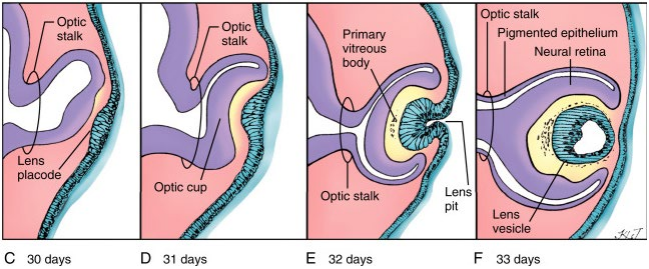<a name="eye-lens-image1"></a>  
> Seen here is the invagination and engulfment of the Surface Ectoderm which will differentiate into the Optical Lens

> 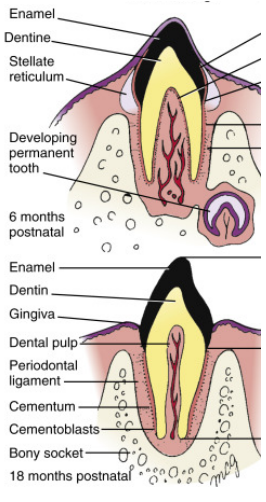<a name="enamel-image1"></a>  
> The Enamel of the tooth is a derivative of the Surface Ectoderm as shown, however the Dentine derives from the Mesenchyme which is either Mesodermic or Neural Crest in origin
#### **Neural Tube: Central Nervous System**<a name="cns"></a>
```
Forms the Central Nervous System
```
- Walls of the tube form the **Brain & Spinal Cord**
- Canal of the tube form the **Ventricles and Central Canal**
  - These are functional spaces within the brain
  - Allow fluid to flow from Brain right down Spinal Cord

#### **Neural Crest: Peripheral Nervous System**<a name="pns"></a>

#### **Neural Crest: Dorsal Root Ganglion**<a name="drg"></a>
```
Sympathetic Nerves
```
#### **Neural Crest: Autonomic Ganglion**<a name="ag"></a>

#### **Neural Crest: Adrenal Medulla**<a name="am"></a>
```
The Medulla of the Adrenal gland is formed from derivatives of Neural Crest
cells while the Cortex of the Adrenal gland is formed from the Mesothelium
```

### Describe the specific contributions of the different types of mesoderm (somites, intermediate, lateral plate)

>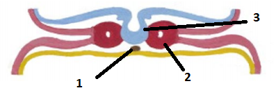
>1. Notochord `Axial Mesoderm`
>2. Paraxial Mesoderm
>3. Neural Tube formation

|                    Mesoderm                     | Derivative Structure        |
| :-----------------------------------------------: | :--------------- |
|      [Paraxial Mesoderm](#paraxial-mesoderm)      | Sclerotome       |
|                                                   | Dermatome        |
|                                                   | Myotome          |
|  [Intermediate Mesoderm](#intermediate-mesoderm)  | Paired Glands    |
| [Lateral Plate Mesoderm](#lateral-plate-mesoderm) | Somatopleure     |
|                                                   | Splanchnopleure  |
|                                                   | Cranial Mesoderm |
|                                                   | Adrenal Cortex   |


----

#### Paraxial Mesoderm
`Form Somites`

Somites have 3 components:
1. Sclerotome
`Sclero - Bone/Skeleton`
   - Develops into Axial Skeleton
     - Vertebrae including ribs (see [image](#sclerotome-image1))
     - Not responsible for [bones in limbs](#lateral-plate-mesoderm)
2. Dermatome
3. Myotome
> Somites are segmented (see [image](#somites-image1))  
> This is why we have numbered vertebrae  
> Similarly, Myotomes are also segmented  

The Dermatome and Myotome fuse existing as **Dermamyotomes**
- Myotome component
  - Forms the muscles of the body wall & limbs


> 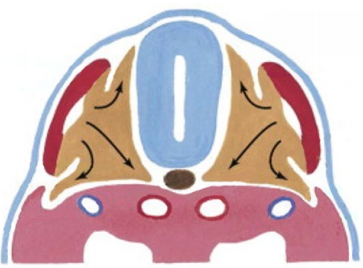<a name="sclerotome-image1"></a>  
> Seen above is migration of Sclerotome to surround the Neural Tube as is expected in formation of our vertebrae


> 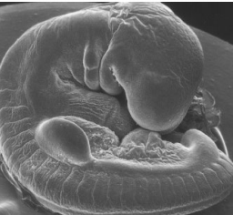<a name="somites-image1"></a>  
> Seen here is an embryo with clear division of the somites along the dorsal surface

----

#### Intermediate Mesoderm
```
Forms paired glands:
    - Kidneys
    - Gonads
    - Accessory Urinary/Reproductive Glands
```

----

#### Lateral Plate Mesoderm
```
Involved with Connective Tissue of the viscera (organs) and body wall.
Has a few special function derivatives too
```
- Somatopleure
  - Body wall
  - Limbs develop as as an extension of the Body Wall
    - Connective tissues, dermis, tendons, bones etc
    - However [not the skeletal muscle](#paraxial-mesoderm)
- Splanchnopleure
- Cranial Mesoderm
  - Complex -> Involved with replacing some derivatives of the Neural Crest Cells in the cranium
- Adrenal Cortex
  - Cortex is formed from mesothelium while the Medulla is formed from Neural Crest Cells

----

### Define each of the four primary tissue types
|Primary Tissue Type|Definition|
|-:|:-|
|Epithelium|
|Connective|
|Muscle|
|Nervous|

### Describe the different subtypes of each tissue type and where they can be found in the body

|Type|Description|Where?|Image|
|:-:|:-|:-:|:-:|
|**Epithelial Tissues**||||
|Simple Squamous|
|Simple Cuboidal|
|Simple Columnar|
|Stratified Squamous|
|Stratified Cuboidal|
|PseudostratifiedColumnar|
|Transitional|
|**Connective Tissues**||||
|Dense Connective Tissue|
|Loose Connective Tissue|
|Reticular Connective Tissue|
|Cartilage|
|Bone|
|Blood|
|Adipose Tissue|
|Embryonic Connective Tissue|
|**Muscular Tissues**||||
|Skeletal Muscle|
|Smooth Muscle|
|Cardiovascular Muscle|
|**Nervous Tissues**||||
|Neurons|
|Neuroglia|


### Describe the respective properties of each subtype of tissue
|Type|Properties|
|:-:|:-|
|**Epithelial Tissues**||
|Simple Squamous|
|Simple Cuboidal|
|Simple Columnar|
|Stratified Squamous|
|Stratified Cuboidal|
|PseudostratifiedColumnar|
|Transitional|
|**Connective Tissues**||
|Dense Connective Tissue|
|Loose Connective Tissue|
|Reticular Connective Tissue|
|Cartilage|
|Bone|
|Blood|
|Adipose Tissue|
|Embryonic Connective Tissue|
|**Muscular Tissues**||
|Skeletal Muscle|
|Smooth Muscle|
|Cardiovascular Muscle|
|**Nervous Tissues**||
|Neurons|
|Neuroglia|

### Be able to identify different tissue types from micrograph images and specimens
### Differentiate cell and tissue types, whilst being able to justify your decision based on what is present and/or not present
### Relate structure to function
### Define each type of epithelia and describe the respective functions/purpose of each
### Describe the different layers of tube structures and understand how they change with function/body site
### Describe the basic histological appearance of section of the nephron of the kidney
### Describe the structure of blood tubes and how to identify/differentiate them
### Describe the different layers and types of skin and how to identify them
### Describe which embryological germ layer each epithelium is derived from


# Physiology
## Cellular Physiology

### Gain an understanding of the field of Physiology

I'm sorry; how is this a learning outcome?

> Hi I'm here for my first semester exam.  
> `Takes a seat`  
> `first page`  
> `Q1: What is physiology?`  
> **Me:**
> 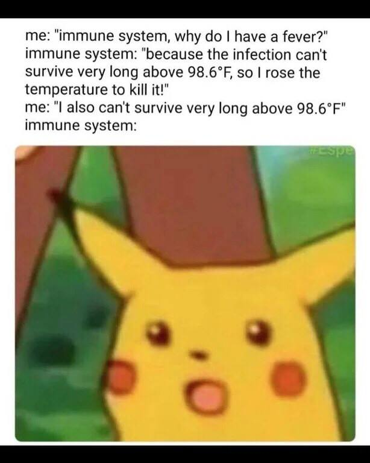
### Describe the level of organisation in the body

Atom -> Molecule -> Macromolecule -> Organelle -> Cell -> Tissue -> Organ -> Organ System -> Organism

### Know the constituents of the intracellular and extracellular environment

Extracellular fluid provides cells a maintained environment for functions

> Extracellular fluid can be divided into two primary constituents:  
> ```
> Fluid component of the blood (Plasma)
> Interstitial Fluid (IF) that surrounds all cells not in blood
> Intracellular Fluid makes up for 60% of the fluid in the body
> ```


| Extracellular Fluid Constituents |
| :------------------------------: |
|               pO2                |
|               pCO2               |
|              [Na+]               |
|               [K+]               |
|              [Ca2+]              |
|              [Cl-]               |
|            [Glucose]             |
|          `Temperature`           |
|              `pH`                    |
> These are the constituents from a slide which describes the "Normal Values" of these constituents. That's why items like Temperature are present

### Discuss the concept of homeostasis and homeostatic control systems

Two Definitions Provided

> **Homeostasis**: Maintenance of static or constant conditions in the internal environment

> :star: **Homeostasis**: Maintain a steady-state dynamic constancy in a system by resisting change.

Homeostatic Control Systems maintain the stability of the internal system through compensating mechanisms
- Control systems operate via negative feedback
- Antagonistic arms work against each other

Control systems require:
1. Some way to measure the regulated variable
2. Some way to alter (effect) the regulated variable
3. Something linking the two

  
> To understand homeostatic control mechanisms:
> 1. Variable? (K+, temp, bp etc)
> 2. Change detection? (receptors)
> 3. Where is decision to act made? (integrating circuit)
> 4. Communication? (afferent/efferent pathways)
> 5. Effectors? (how is variable regulated)
> 6. How does the negative feedback loop operate?

---

**Control Concepts**

|Mechanism|Description|
|-:|:-|
|Negative Feedback|Most Common|
| |Oppose the direction of change then switch themselves off|
|Positive Feedback|**non-homeostatic**|
| |Examples: Blood clotting, neuronal excitation, child birth|


:exclamation: Feed**back** mechanisms are inherently response **after** the fact; the system is "catching up"

---

**Feed-forward Control**

> Anticipatory alteration of effectors - independent of feedback

- Parametric feedforward | Adaptive Control
  - System adapts from previous failures
> Eg: Ballistic control, ball throwing
- Predictive homeostasis | Anticipatory control
  - System anticipates and alters effectors before the causative agent has occured
> Eg: Increasing cardiac function in anticipation of exertion

### Know that multicellular life involves specialisation of individual cells and communication between cells

Do you know this? Now you do.

### Describe and understand the forms of communication between cells


There is also Neuroendocrine

---

**Juxtacrine**

Transmembrane/membrane-bound ligand binds receptor of neighbouring target cell.  

> Neurons notch signalling

---

**Gap Junctions**

Specialised intercellular connection joins the 2 cytoplasms. Allows passage of molecules/ions. Diffusion of these molecules/ions down concentration gradients is the method of communication.

> Cardiac muscle cells propogation of action potentials

---

**Autocrine**

Ligand is secreted into ECF to act on transmembrane receptor of secreting cell.

> Interleukin-1 in monocytes

---

**Paracrine**

Ligand is secreted into the ECF and acts on target cell receptors at a distance-not in direct physical contact

> Fgf

---

**Endocrine**

Ligand is secreted into the blood where it travels and acts on target cells down stream

> Hormones - Insulin

:label: Very common
---

**Neural**

Neuron secretes ligand (neurotransmitters) to act on connected cells.

> Muscle, glands

:label: Neural communication is more specific, however is unfit for more "general" messaging

:label: Very common
---

**Neuroendocrine**

Combined neural and endocrine signalling.

---

It is suggested that knowing the name of the receptor (Baroreceptor) and having a general understanding of how this control system works is sufficient:  


### Describe the cellular level of organisation
### List the main organelles and other major structures of a cell, describe their structure and explain their functions
### Develop an understanding of membrane structure and function
### Understand membrane permeability, diffusion, osmosis, osmolarity and tonicity
### Know the osmolarity of ICF and ECF
### Understand passive diffusion, carrier mediated transport, primary and secondary active transport
### Understand how coupled transport enables the movement of solutes against an electrochemical gradient
### Understand exo and endo-cytosis
### Know the composition of different body fluid compartments
### Explain the ionic basis of membrane potentials
### Describe & explain the ionic basis of electrical signaling in nerve and muscle cells (action potentials)
### Explain the process of sensory transduction
### Describe how action potentials are propagated along membranes
### Describe neurotransmitter & synaptic physiology
### List common neurotransmitters, their receptors and effects
### Describe the processes involved in the regulated release of neurotransmitters
### Outline the metablolism (production and destruction) of neurotransmitters
### Describe the formation of both IPSPs and EPSPs

# Biochemistry

### Name the cellular macromolecules, and have an understanding of their structure and function

:warning: The remaining parts of this learning outcomes are likely to be covered and filled in a later lecture

|Macromolecule|Structure|Function|
|-:|:-|:-|
|Phospholipids|
|DeoxyriboNucleic Acid (DNA)|
|RiboNucleic Acid (RNA)|
|Proteins|
|Polysaccharides (Sugars)|
### Know the biologically important elements and which macromolecules they are in

### Define an atom (including electron arrangement in shells), electron, neutron and proton

- Atom
  - Building block of all matter
  - Composed of Protons, Neutrons and Electrons
  - Properties are decided by the number of each subatomic particle
- Nucleus
  - Protons & Neutrons
- Proton
  - (+) Charge
  - Relative Weight of 1
- Neutron
  - No Charge
  - Relative Weight of 1
- Electron
  - (-) Charge
  - Relative Weight of 0 (0.005)
- Electron Orbital
  - Each Orbital 'holds' 2 electrons
  - Orbitals further to Nucleus contain more energy
  - Electrons can gain/lose energy to move between Orbitals
- Electron Shells
  - Electron -> Orbital -> Sub Shell -> Shell
  - Sub shells hold a specific number of Orbitals/Electrons
    - s
      - 2 electrons
    - p
      - 6 electrons
    - d
      - 10 electrons
    - f
      - 14 electrons
  - Shell Electron arrangements: 
| Shell Number | Electrons | Sub-Shells |
|-:|:-:|:-:|
|1|2|*1s*|
|2|8|*2s, 2p*|
|3|18|*3s, 3p, 3d*|

- Valence Shell
  - Outermost electron shell
  - Valence Electrons = Electrons in this outer shell
- Atomic Number
  - Number of Protons
- Atomic Mass
  - Number of Protons & Neutrons
- Isotope
  - Elements with different number of Neutrons
- Chemical Reactivity
  - Noble Gas Rule
    - `An atom bonds to fill its outer shell of electrons and to achieve the number of electrons of the noble gas nearest to it`
  - Elements will undergo reactions/form bonds to achieve this

---

>   
> This shows the order with which sub-shells fill their electron due to the nature of electrons filling Sub-Shells of lower energy over filling Shells of lower energy first.  
> This demonstrates why although Shell 3 should have 18 electrons, it usually has 8.
> 
### Describe covalent and noncovalent bonds and give examples
Sharing/Exchanging e- to fill valence shell forms chemical bonds.  
Atoms join to form molecules.

**Covalent Bonds**
> A covalent bond is a chemical bond that involves sharing electron pairs between atoms
> 
> Examples of Covalent bonding:
> - Oxygen
>     - Double Covalent Bond between two oxygen atoms
>     - O=O
> - Water (H2O)
>     - Two Hydrogens Covalent Bonded to Oxygen with Single Covalent Bonds
>     - H-O-H


**Non-Covalent Bonds**
> Do not involve the sharing of electrons.  
> Involves weaker electromagnetic interactions between molecules or within a molecule  
> 
> There are Ionic Bonds, Hydrogen Bonds, Van der Waals forces, Hydrophobic interactions, Dipole-Dipole forces  
> 
> Examples: NaCl; binding forces that keep Water a liquid at room temperature (Hydrogen Bonds)

:label: Covalent bonds form molecules while Non-Covalent bonds bring them together. Examples of this are cellular structures such as Ribosomes.

### Have an understanding of the chemistry of carbon and its importance in organics
> Carbon is the building block of all Organic molecules

|Property|Value (if relevant)|
|:-:|:-:|
|Atomic Number|6|
|Atomic Mass|12|
|Potential to form 4 bonds||
|Single bonds are shorter than double bonds||
|Single bonds can rotate||
|Aliphatic|Carbon chain compounds|
|Aromatic|Ring structures|


### Have a general understanding of the different types of bonds and relative bond energies

|Bond|Energy<br/>Remember Relative Str|
|-:|:-:|
|Double Covalent Bond|>600|
|Single Covalent Bond|>210|
|**Non Covalent Bonds:**|
|Ionic Bonds|4-80|
|Hydrogen Bonds|12-30|
|Van der Waals|0.3-9|
|Hydrophobic Interactions|weak|


**Covalent Bonds**
> Atoms involved in Covalent Bonds however are not the same. Oxygen would have a much stronger pull on the electrons than Hydrogen would. This ability is measured by Electronegativity.  
> Examples of high Electronegative elements are Fluoride, Oxygen and Nitrogen  
> 
> This is an important concept in organics. In a covalent bond, the shared electrons will be closer towards the more Electronegative atom. This will create a minor polarity or 'charge' across the molecule.  
> 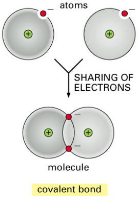  
> :label: Singular Covalent bonds inherently allow some flexibility in the molecule, this is lost in Double Covalent Bonds as seen in Ethane vs Ethene


**Non-Covalent Bonds**
> Below you can see the formation of Ionic Bonds:   
> 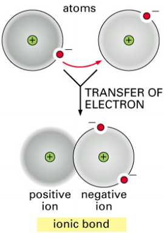  
> An example of this is NaCl
> 
> Hydrogen Bonds involves the interaction molecules that contain High Electronegative elements such as Oxygen bound to Hydrogen. The Polarity created in this covalent bond is significant. The Positive polar Hydrogen atoms would interact with the Negative polar bound atoms in other molecules.  
>   
> An example of a material that is heavily dependent on this interaction is Water.  
> It explains why, despite the low molecular weight, that water can exist as a liquid at room temperature.

**Ionic Bonds**

> :label: Not all Ionic bonds involve *complete* e- transfer

|Name|Charge|
|:-:|:-:|
|Cation|+|
|Anion|-|

Due to their charge, Cations and Anions bond together to form Ionic Bonds
> :label: This bond forms due to electromagnetic attraction. Can be broken/dispersed by other electromagnetic interactions. This is seen with **hydration**

**Hydrogen Bonds**

> :label: O-H is a strong dipolar bond. This means O has - polarity while H has + polarity

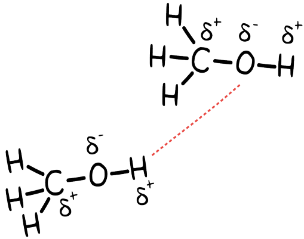  

### Define polarity, chemistry and properties of water and its role in ionisation and hydration

---

```
Electronegativity is arbitrarily measured; it increases as you go from
left to right, and from bottom to the top of the periodic table.
```

---

:pushpin: Covalent bonds between different electronegative elements have an uneven distribution of charge and therefore have polarity/charge

:pushpin: Electronegative elements: Oxygen, Nitrogen, Fluoride

:grey_question: Below is the electronegative values of biologically important elements. Bonds are considered non-polar if the difference between them is not >0.5

|Element|Electronegativity|
|-:|:-:|
|H|2.1|
|C|2.5|
|**N**|**3**|
|**O**|**3.5**|
|**F**|**4**|

Therefore, molecules lacking electronegative atoms are non polar (eg: Ethane)
> Reactivity of molecules is associated with # polarised bonds

---

**Water**
|Water Properties|
|:-:|
|:small_red_triangle: Boiling Point|
|:small_red_triangle: Melting Point|
|:small_red_triangle: Heat of Vaporisation|
|Strong Cohesion|
|Strong Surface Tension|
|Hydrogen bonds ~ 2x longer than O-H|
|Floats as solid|
|Hydrogen Bonds form lattice in solid|
|Excellent solvent for polar solutes|

- H2O is polar
  - Able to interact with other polar & charged groups
  - Forms Hydrogen bonds
- Hydrophilic
  - Groups that interact with water
- Hydrophobic
  - Nonpolar groups

---

**Ionisation**

When a highly electronegative atom captures electrons from other atoms during chemical reactions

---

**Hydration**

When Polar Water molecules surround ions and 'shield' them from one another.


> :label: Ionic compounds can therefore separate into constituent anions and cations in water
> 
> :label: Nonionic compounds can also dissolve through forming hydrogen bonds. Eg: alcohol, sugars etc
> > Water forms hydration shell and maintains Hydrogen bonds between other water molecules

### Define concentration, mole and molarity

> Avagadro's number = 6.022 x 10^23

|Term|Definition|
|-:|:-|
|Concentration|Molarity or grams per litre|
|Mole|Avagadro's number of molecules|
|Molarity (M)|1 mole in 1 litre|


### Describe the differences between acids and bases, and between strong/weak acids and bases

|Term|Definition|
|-:|:-|
|Acid|Proton donor|
|Base|Proton acceptor|
|Strong|Completely ionises in solution|
|Weak|Partially ionises in solution|
|`Strong Bases produce proton-accepting species (eg: OH-)`||

### Define pH and know what physiological pH is

**pH**
> Measure of acidity in terms of molar concentration
```
Scale: 0-14
^ pH = more Basic
v pH = more acidic
pH 7 = neutral
```

**Physiological pH** = 7.4

### Understand the role of buffers

> :grey_exclamation: Remember reversible reactions:
> ```
> Lets say there is a reversible reaction such as the Ionisation of a weak acid:
>   HA  +  H2O <-> H3O+  +  A-
> These reactions have an equilibrium point. Adding more of a chemical of either
> side of the reaction will drive the reaction to remove the added chemical and
> reachieve equilibrium.
> ```

Physiological processes require tight control of pH. This is achieved through buffering.

**Buffers** resist changes in pH usually brought about by addition of acid/base. They are weak acids and/or bases.

### Name and distinguish between organics such as alkanes, alkenes, alcohols, thiols, aldehydes, carboxylic acids, amines and aromatics
|Organic|Description|Example|
|:-|:-|:-:|
|Alkanes|Contain C & H with single bonds|Methane 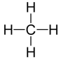|
|Alkenes|Contain C=C double bonds|Ethene 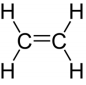|
|Alcohol|Addition of hydroxyl group (-OH)|Ethanol |
|Thiols|Addition of sulfhydryl group (-SH)||
|Aldehyde|Contain C=O||
|Carboxylic Acid|End Carbon has Oxygen double bond and a hydroxyl bond|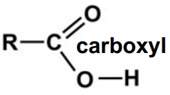|
|Amine|Derived from ammonia (NH3)|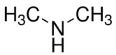<br/>|
|Aromatics|Ring structures of carbon (or another Element) chains|**Benzene** |
|`Benzene demonstrates electron resonance. The double bonds and single bonds can swap repeatedly; there is conjugation of the p orbitals within the structure. This electron movement increases the stability of Benzene. This principle can be represented by a circle within the Aromatic`<a name="electron-resonance"><a/>||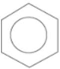|


> :label: The following table is not required under this learning outcome, however may be helpful.
> 
> |Root|Number of C Atoms|
> |-:|:-:|
> |Meth**yl**|1|
> |Eth**yl**|2|
> |Prop**yl**|3|
> |But**yl**|4|
> |Pent**yl**|5|
> |Hex**yl**|6|
> |Hept**yl**|7|
> |Oct**yl**|8|
> |Non**yl**|9|
> |Dec**yl**|10|

> :label: The following explains cis/trans isomers however is not required under this learning outcome
> ```
> Alkenes do not allow rotational/geometric flexibility = Geometric Isomers which can have
> physically different properties.
> Geometric isomers labeled cis or trans.
> ```
> 

### Understand how conjugation in aromatic rings impacts structure and function
[See above](#electron-resonance)

### Recognise the functional groups given

|Functional Group|Image|
|-:|:-:|
|Hydroxyl||
|Amino||
|Carboxyl|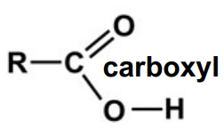|
|Aldehyde||
|Ketone||
|Methyl|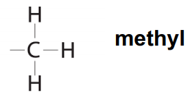|
|Sulfhydryl||
|Disulfide||
|Acetyl|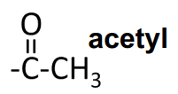|
|Phosphate|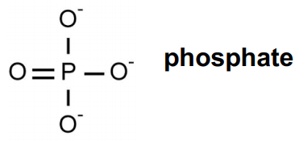|
### Have an understanding of the importance of isomers, particularly optical isomers
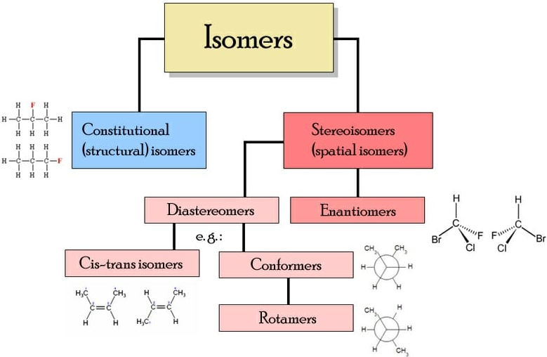

:grey_exclamation::grey_question: Only Enantiomers and Constitutional Isomers discussed in lecture; there wasn't any direct reference made to Diastereomers


> Molecule is Chiral if it cannot be superposed on its mirror image by any combination of rotations and translations  
> ```
> Derived from Ancient Greek meaning of "hand"
> ```

|Isomerism|Definition|
|-:|:-|
|Structural Isomer|Different in specific attachment of atoms and functional groups|
| |`There are subdivisions under this: Chain isomers; Position isomers; Functional group isomers; Skeletal isomers; Tautomer`
|Stereoisomer|Identical Bond structure but different with geometric position of functional groups & atoms|
|Enantiomers|Mirror images which contain chiral centres & are not superimposable|
|`Diastereomers`|`Are not mirror-images; may or may not contain chiral centers`|
|`Conformational Isomers`|`Different rotations around single bonds`|

:question: Enantiomer and Optical Isomer are interchangeable terms. You could argue it might be more correct to call a set of Optical Isomers Enantiomers. You do you.

:label: Enantiomers are labeled by their deflection of light
|Enantiomer|Light Deflection|
|:-:|:-|
|D|Right|
|L|Left|
|-||
|R|Right|
|S|Left|
|-||
|+|Right|
|-|Left|
> The above is separated into their nomenclature groups. Don't use S with D or + etc. Stick with one. Both groups are easy to remember because L = Left and R = Right. You just have to remember the paired nomenclature.

In relation to Enantiomers, a **racemic** mix has equal amounts of both D and L enantiomers = no optical activity

Enantiomers are detrimental in the development of pharmaceuticals. Often only 1 isomer has desired effect (target cell receptors have isomerism too; you can't expect both isomers to fit the same target).

> 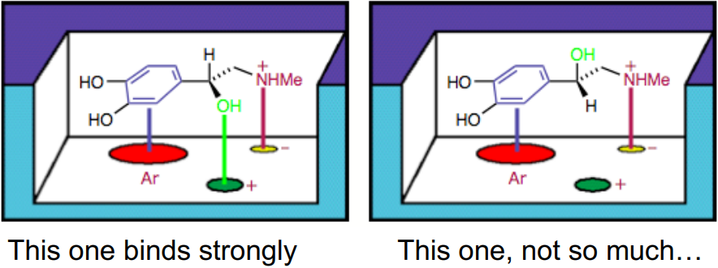
> :grey_question: Thalidomide was a racemic mix. One isomer was responsible for the relief of morning sickness while the other isomer was the cause of its teratogenicity.

### Recognise carbohydrates and derivatives
### Recognise the structure and roles of glycerol, fatty acids, triacylglycerols, phospholipids and steroids
### Recognise that AA have chemical classifications, and know the basic and acidic AA names
### Understand that AA are zwitterions and be able to draw their structure and different pHs
### Understand and be able to draw and label components of peptides, and know levels of protein structure hierarchy, including bonds and structures therein
### Define prosthetic groups, simple, conjugated, fibrous globular, native and denatured proteins
### Know the general functions of proteins
### Understand that proteins bind ligands
### Have a basic understanding of metabolism & energetics of reactions
### Know the meaning of: free energy, substrate, product, active site, transition state, activation energy, endergonic reaction, exergonic reaction, energy transfer
### Have a basic understanding of cellular energy and ATP's role in the cell
### Have an understanding of enzymes as catalysts and of the mechanism of enzyme action in cells
### Understand the impact on enzyme activity of temperature, pH, substrate concentration
### Understand the need for controlling enzyme activity, including: allosterism, inhibitors, inhibition and feedback
### Appreciate the role of enzymes, pathways, "high energy" carriers, cofactors & coenzymes in metabolism
### Know the general classes of enzymes and their functions
### Understand redox reactions and the role of redox reactions in metabolism
### Know that NADH & FADH2 are important electron carriers
### Understand the significance of Redox Potential values
### Understand reduced bonds and realise that many of our metabolic pathways are oxidative
### Have a general understanding of metabolism, the need for integration of metabolism and the sharing of metabolic roles within the body


# CAMDH

### Describe the cultural diversity within the Aboriginal Population
### Discuss the cultural determinants and how they influence health in Aboriginal people and Communities
### Understand Aboriginal culture from a strength-based perspective

# Pathology

### Know, understand and discuss the important and common diseases (`core conditions`)

### Demonstrate and apply knowledge of general pathological processes and specific diseases in clinically relevant contexts

### Define important terms including: pathology, disease, pathogenesis, aetiology, sign, symptom, test, risk factor, complication and others outlined in the lectures
### Be able to list the basic pathological processes that underpin more complex diseases
### Describe ways that disease can be classified, the terminology associated with classification, and why classification is important
### Understand how knowledge of pathology, pathogenesis and aetiology of disease can be utilised in patient care
### Be aware of the different branches of pathology as a clinical and diagnostic discipline and understand the range of tools available for use by pathologists

<!-- ### Describe pathology in terms of where it is, lesion descriptions -->
# Need the learning outcomes for the Path lectures in week 2 after marcus

# Microbiology

# Behavioural Science

### Discuss patient-centred care and its relevance to health outcomes
### Explore the patient experience of illness including the impact of the medical condition on the patient and their support network
### Describe basic communication and interviewing skills required to conduct a doctor-patient interview, including: asking questions; attentive and active listening; facilitation; clarification; silence and reflection; and summarising
### Understand the importance of positive and negative verbal and non-verbal communication in doctor-patient communication


# Health Humanities

### Discuss historical perspectives of health and its relation to changing beliefs and scientific understanding
### Explore social construction of health and wellness today
### Discuss determinants of health
### Describe the changing role of the patient

